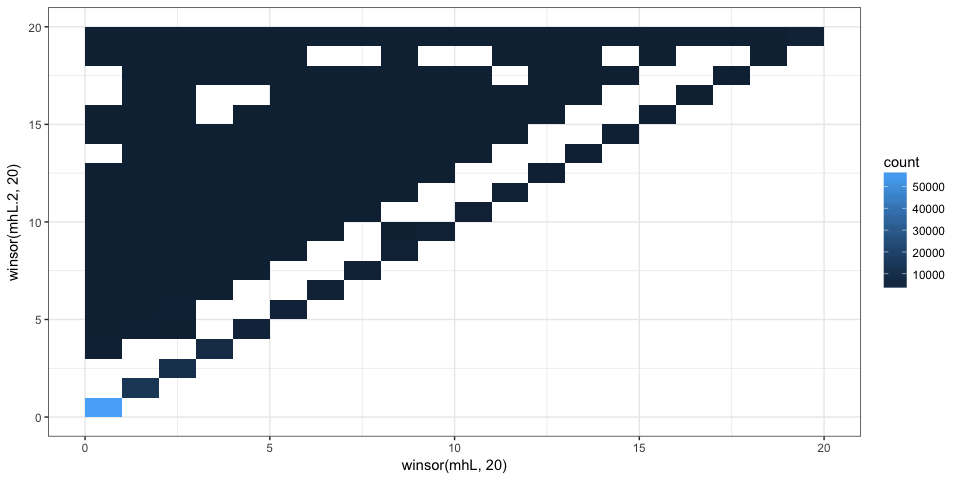
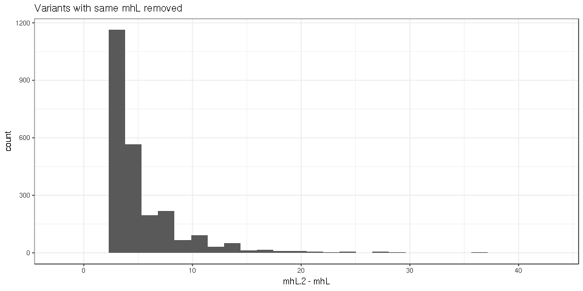
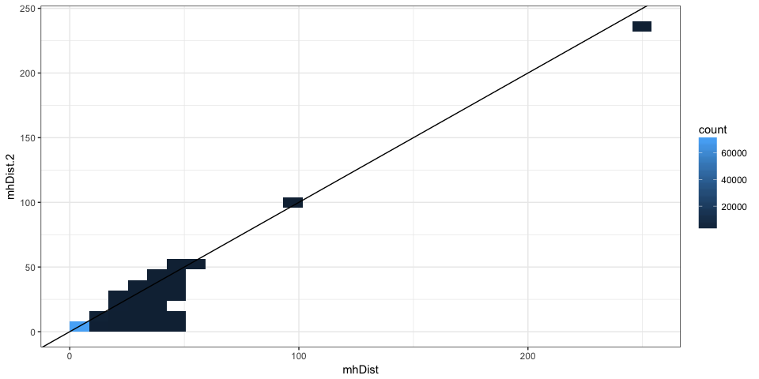
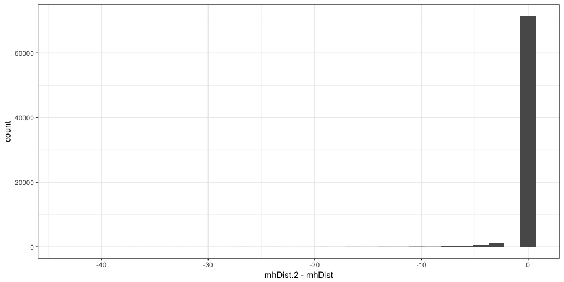
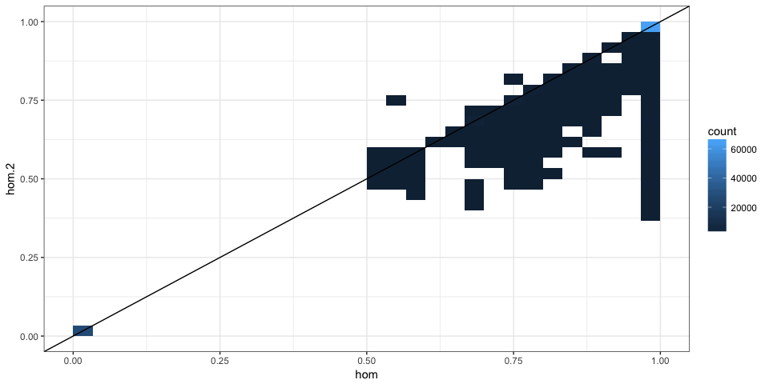
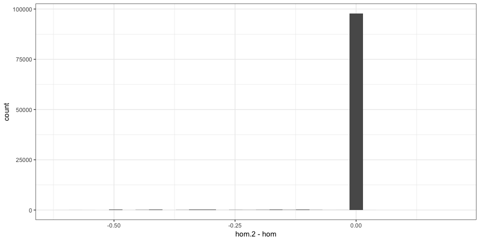

Allowing for 2 consecutive mismatches in the MH
===============================================

MHcut was run twice: allowing for maximum one consecutive mismatch and allowing for 2. Here both output are compared to quantify how much we gain/lose.

A quick summary in [benchmark-summary.md](benchmark-summary.md) shows the effect on the number of variants for a few selection criteria.

``` r
## For data manipulation
library(data.table)
library(dplyr)
library(magrittr)

## For graphs and tables
library(ggplot2)
library(knitr)

## Functions
winsor <- function(x, u = 10) {
    if (any(x > u)) 
        x[x > u] = u
    x
}
```

We load the coordinate column, rs ID and the MH columns that we want to compare (mhL, mh1L, hom, mhDist).

``` r
## read.table('../data/mhcut-dbsnp-clinvar-deletion-variants.tsv.gz',
## nrows=1)
var1 = fread("../scripts-dbSNP-ClinVar/dbsnp-clinvar-deletion-100KforBenchmark-1CMM-jellyfish-bestFl-variants.tsv", 
    select = c(1:4, 20:23, 25))
var2 = fread("../scripts-dbSNP-ClinVar/dbsnp-clinvar-deletion-100KforBenchmark-2CMM-jellyfish-bestFl-variants.tsv", 
    select = c(1:4, 20:23, 25))
```

We then merge the two output by coordinate and rs ID. This takes a few minutes, there are 2x43M to merge after all.

``` r
setkey(var1, chr, start, end, RS, varL)
setkey(var2, chr, start, end, RS, varL)
colnames(var2)[6:9] = paste0(colnames(var2)[6:9], ".2")
var = merge(var1, var2)
var = var[, .(chr, start, end, RS, varL, mh1L, mh1L.2, mhL, mhL.2, hom, hom.2, 
    mhDist, mhDist.2)]
head(var)
```

    ##     chr  start    end         RS varL mh1L mh1L.2 mhL mhL.2 hom hom.2
    ## 1: chr1  13229  13229 1452078127    1    0      0   0     0   0     0
    ## 2: chr1  66375  66375 1315341348    1    0      0   0     0   0     0
    ## 3: chr1  99023  99023 1404242465    1    0      0   0     0   0     0
    ## 4: chr1 138097 138099 1373342756    3    2      2   2     2   1     1
    ## 5: chr1 259817 259817 1252152510    1    1      1   1     1   1     1
    ## 6: chr1 260959 260959 1353644827    1    1      1   1     1   1     1
    ##    mhDist mhDist.2
    ## 1:     NA       NA
    ## 2:     NA       NA
    ## 3:     NA       NA
    ## 4:      1        1
    ## 5:      0        0
    ## 6:      0        0

Same *mh1L*?
------------

Allowing for consecutive mismatches shouldn't affect the first stretch of exact matches in theory.

``` r
mean(var$mh1L == var$mh1L.2)
```

    ## [1] 0.99999

``` r
var.m1 = as.data.frame(var[mh1L != mh1L.2, ])
```

There are 1 variants with different *mh1L*. Hum...

My only guess is that the selection of the *best* flanks was different. Allowing for 2 consecutive mismatches produced sometimes a longer MH for the alternative flank pair which was then selected, leading to different MH metrics. Maybe I can recompute the score that was used to chose the best flank. If the score in the 2-mismatches run is always higher, then it fits with the explanation. The score gives a weight of 2 for the first stretch of exact match and 1 to other matches.

``` r
var.m1 %>% mutate(score = mh1L + hom * mhL, score.2 = mh1L.2 + hom.2 * mhL.2) %>% 
    kable
```

| chr   |     start|       end| RS        |  varL|  mh1L|  mh1L.2|  mhL|  mhL.2|   hom|  hom.2|  mhDist|  mhDist.2|  score|  score.2|
|:------|---------:|---------:|:----------|-----:|-----:|-------:|----:|------:|-----:|------:|-------:|---------:|------:|--------:|
| chr14 |  30895088|  30895095| 386776068 |     8|     1|       3|    8|      6|  0.63|   0.67|       0|         2|   6.04|     7.02|

That fits with the *flank selection* explanation.

Longer micro-homology?
----------------------

``` r
mean(var$mhL.2 > var$mhL)
```

    ## [1] 0.02466

Around 2.5% of the variants have a longer MH when allowing for 2 mismatches.

Graphs with a random subset of the data:

``` r
var.ss = var[sample.int(nrow(var), 1e+05), ]
ggplot(var.ss, aes(x = mhL.2 - mhL)) + geom_histogram() + theme_bw()
```



``` r
var.ss %>% filter(mhL != mhL.2) %>% ggplot(aes(x = mhL.2 - mhL)) + geom_histogram() + 
    theme_bw() + ggtitle("Variants with same mhL removed")
```



Any with shorter MH?

``` r
sum(var$mhL.2 < var$mhL)
```

    ## [1] 1

``` r
var[mhL.2 < mhL, ]
```

    ##      chr    start      end        RS varL mh1L mh1L.2 mhL mhL.2  hom hom.2
    ## 1: chr14 30895088 30895095 386776068    8    1      3   8     6 0.63  0.67
    ##    mhDist mhDist.2
    ## 1:      0        2

Most likely because of the *flank selection*.

Shorter mhDist?
---------------

If the MH length is longer, the distance between MH should be smaller.

Graphs with a random subset of the data:

``` r
ggplot(var.ss, aes(x = mhDist.2 - mhDist)) + geom_histogram() + theme_bw()
```



``` r
var.ss %>% filter(mhL != mhL.2) %>% ggplot(aes(x = mhDist.2 - mhDist)) + geom_histogram() + 
    theme_bw() + ggtitle("Variants with same mhL removed")
```



As expected most of the variants that were further extended have a shorter distance between their MH.

Lower homology?
---------------

Graphs with a random subset of the data:

``` r
ggplot(var.ss, aes(x = hom.2 - hom)) + geom_histogram() + theme_bw()
```



``` r
var.ss %>% filter(mhL != mhL.2) %>% ggplot(aes(x = hom.2 - hom)) + geom_histogram() + 
    theme_bw() + ggtitle("Variants with same mhL removed")
```



As expected most of the variants that were further extended have a lower homology.
