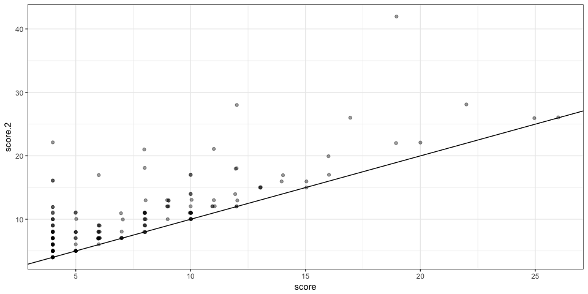
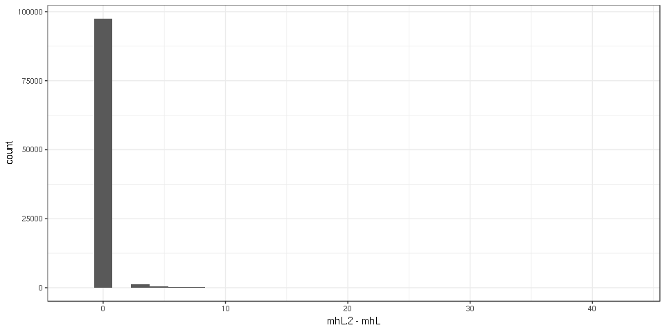
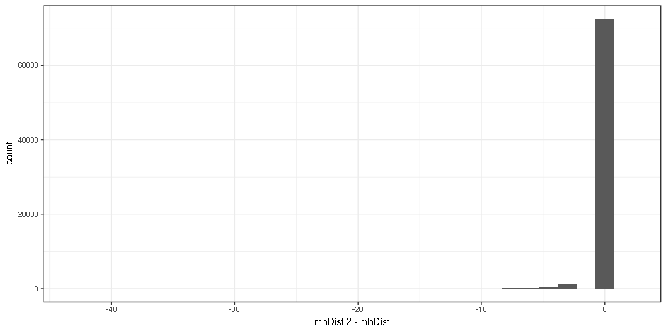
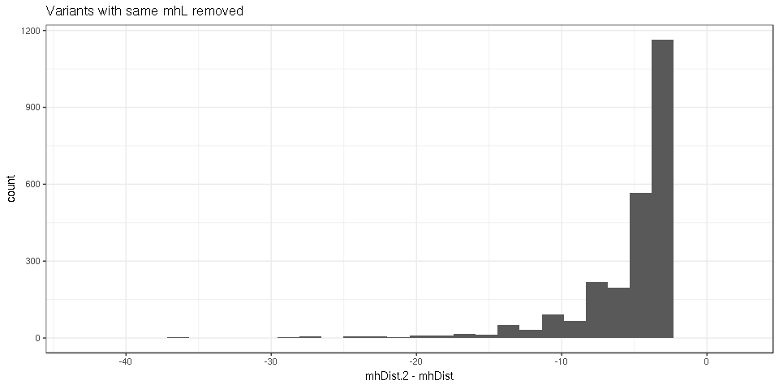
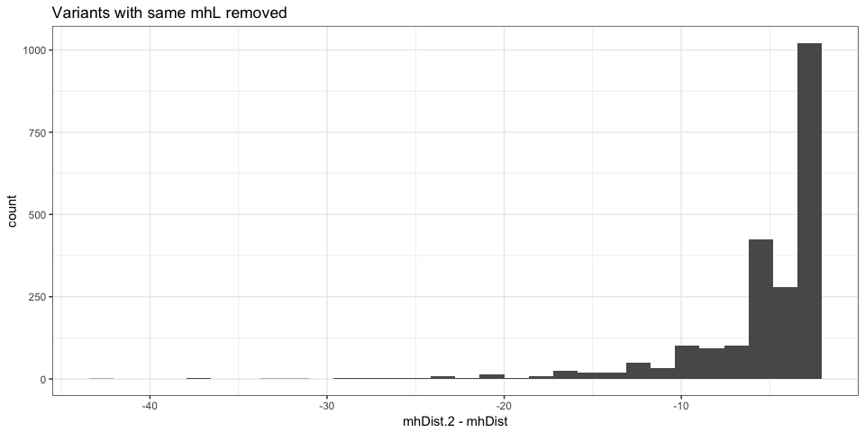
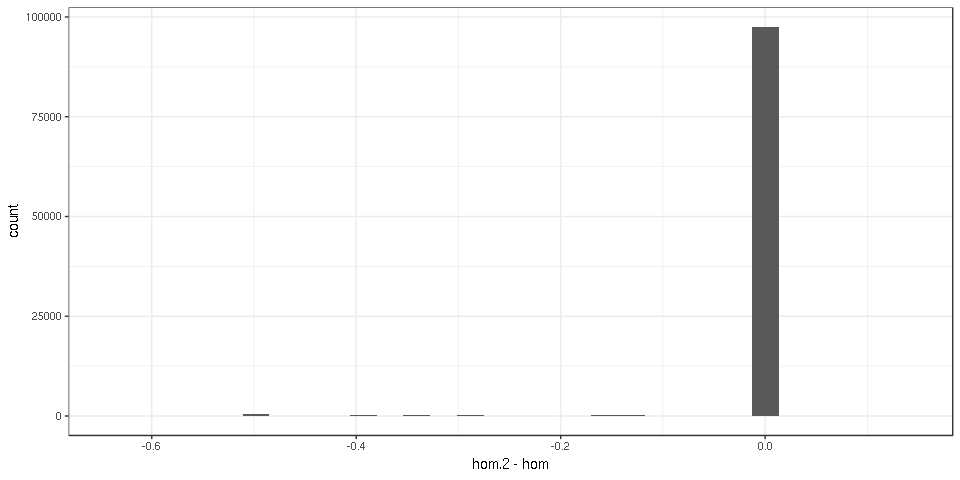
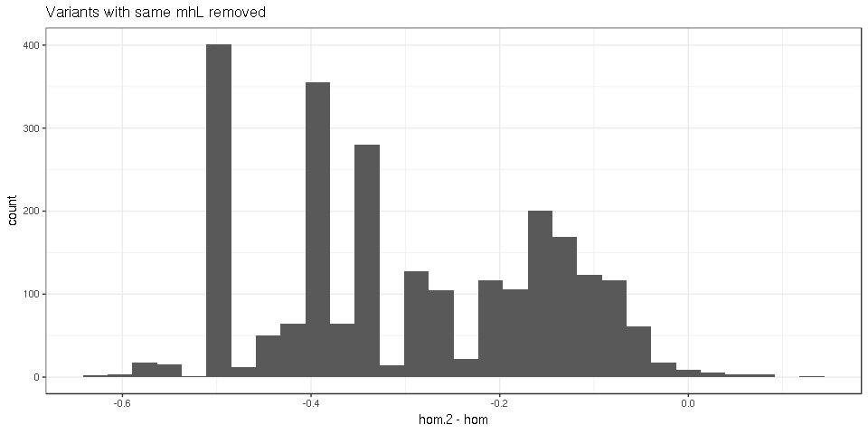
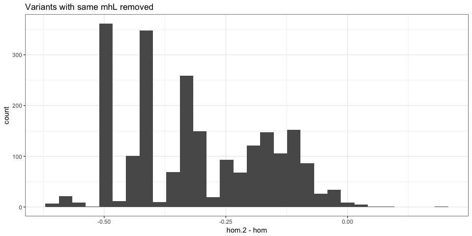

Allowing for 2 consecutive mismatches in the MH
===============================================

MHcut was run twice: allowing for maximum one consecutive mismatch and
allowing for 2. Here both output are compared to quantify how much we
gain/lose.

``` r
## For data manipulation
library(data.table)
library(dplyr)
library(magrittr)

## For graphs and tables
library(ggplot2)
library(knitr)

## Functions
winsor <- function(x, u = 10) {
    if (any(x > u)) 
        x[x > u] = u
    x
}
```

We load the coordinate column, rs ID and the MH columns that we want to
compare (mhL, mh1L, hom, mhDist).

``` r
## read.table('../data/mhcut-dbsnp-clinvar-deletion-variants.tsv.gz',
## nrows=1)
var1 = fread("gunzip -c ../data/mhcut-dbsnp-clinvar-deletion-variants.tsv.gz", 
    select = c(1:4, 20:23, 25))
var2 = fread("gunzip -c ../data/mhcut-dbsnp-clinvar-deletion-2MM-variants.tsv.gz", 
    select = c(1:4, 20:23, 25))
```

We then merge the two output by coordinate and rs ID. This takes a few
minutes, there are 2x43M to merge after all.

``` r
setkey(var1, chr, start, end, RS, varL)
setkey(var2, chr, start, end, RS, varL)
colnames(var2)[6:9] = paste0(colnames(var2)[6:9], ".2")
var = merge(var1, var2)
var = var[, .(chr, start, end, RS, varL, mh1L, mh1L.2, mhL, mhL.2, hom, hom.2, 
    mhDist, mhDist.2)]
head(var)
```

    ##     chr start   end         RS varL mh1L mh1L.2 mhL mhL.2  hom hom.2
    ## 1: chr1 10109 10114 1377973775    6    6      6   6     6 1.00  1.00
    ## 2: chr1 10110 10114 1462685959    5    1      1   4     4 0.75  0.75
    ## 3: chr1 10120 10120 1156821933    1    0      0   0     0 0.00  0.00
    ## 4: chr1 10129 10147 1457723673   19   19     19  19    19 1.00  1.00
    ## 5: chr1 10132 10132 1289482855    1    0      0   0     0 0.00  0.00
    ## 6: chr1 10133 10137 1390118706    5    0      0   0     0 0.00  0.00
    ##    mhDist mhDist.2
    ## 1:      0        0
    ## 2:      1        1
    ## 3:     NA       NA
    ## 4:      0        0
    ## 5:     NA       NA
    ## 6:     NA       NA

Same *mh1L*?
------------

Allowing for consecutive mismatches shouldn’t affect the first stretch
of exact matches in theory.

``` r
mean(var$mh1L == var$mh1L.2)
```

    ## [1] 0.9999962

``` r
var.m1 = as.data.frame(var[mh1L != mh1L.2, ])
```

There are 164 variants with different *mh1L*. Hum…

My only guess is that the selection of the *best* flanks was different.
Allowing for 2 consecutive mismatches produced sometimes a longer MH for
the alternative flank pair which was then selected, leading to different
MH metrics. Now I regret not having a column which record which flanks
were used (outer-inner or inner-outer).

Maybe I can recompute the score that was used to chose the best flank.
If the score in the 2-mismatches run is always higher, then it fits with
the explanation. The score gives a weight of 2 for the first stretch of
exact match and 1 to other matches.

``` r
var.m1 %>% mutate(score = mh1L + hom * mhL, score.2 = mh1L.2 + hom.2 * mhL.2) %>% 
    ggplot(aes(x = score, y = score.2)) + geom_point(alpha = 0.4) + theme_bw() + 
    geom_abline()
```



That fits with the *flank selection* explanation.

Longer micro-homology?
----------------------

``` r
mean(var$mhL.2 > var$mhL)
```

    ## [1] 0.0221911

Around 2.2% of the variants have a longer MH when allowing for 2
mismatches.

Graphs with a random subset of the data:

``` r
var.ss = var[sample.int(nrow(var), 1e+05), ]
ggplot(var.ss, aes(x = winsor(mhL, 20), y = winsor(mhL.2, 20))) + geom_bin2d(binwidth = c(1, 
    1)) + theme_bw()
```



``` r
ggplot(var.ss, aes(x = mhL.2 - mhL)) + geom_histogram() + theme_bw()
```


``` r
var.ss %>% filter(mhL != mhL.2) %>% ggplot(aes(x = mhL.2 - mhL)) + geom_histogram() + 
    theme_bw() + ggtitle("Variants with same mhL removed")
```


Any with shorter MH?

``` r
sum(var$mhL.2 < var$mhL)
```

    ## [1] 6

``` r
var[mhL.2 < mhL, ]
```

    ##      chr     start       end        RS varL mh1L mh1L.2 mhL mhL.2  hom
    ## 1: chr10 120690688 120690699 386748260   12    1      4  11     9 0.82
    ## 2: chr14  30895088  30895095 386776068    8    1      3   8     6 0.63
    ## 3: chr19  42213783  42213802 386809414   20    1      2  10     8 0.60
    ## 4:  chr2 201468090 201468101 796800290   12    4      7  12    10 0.92
    ## 5:  chr5  58212179  58212196 774210060   18    1      1  18    15 0.61
    ## 6:  chrX 100699403 100699416 386826653   14    1      2  14    12 0.64
    ##    hom.2 mhDist mhDist.2
    ## 1:  0.67      1        3
    ## 2:  0.67      0        2
    ## 3:  0.63     10       12
    ## 4:  0.80      0        2
    ## 5:  0.73      0        3
    ## 6:  0.75      0        2

Just a few and most likely because of the *flank selection*.

Shorter mhDist?
---------------

If the MH length is longer, the distance between MH should be smaller.

Graphs with a random subset of the data:

``` r
ggplot(var.ss, aes(x = mhDist, y = mhDist.2)) + geom_bin2d() + theme_bw() + 
    geom_abline()
```



``` r
ggplot(var.ss, aes(x = mhDist.2 - mhDist)) + geom_histogram() + theme_bw()
```



``` r
var.ss %>% filter(mhL != mhL.2) %>% ggplot(aes(x = mhDist.2 - mhDist)) + geom_histogram() + 
    theme_bw() + ggtitle("Variants with same mhL removed")
```



As expected most of the variants that were further extended have a
shorter distance between their MH.

Lower homology?
---------------

Graphs with a random subset of the data:

``` r
ggplot(var.ss, aes(x = hom, y = hom.2)) + geom_bin2d() + theme_bw() + geom_abline()
```



``` r
ggplot(var.ss, aes(x = hom.2 - hom)) + geom_histogram() + theme_bw()
```



``` r
var.ss %>% filter(mhL != mhL.2) %>% ggplot(aes(x = hom.2 - hom)) + geom_histogram() + 
    theme_bw() + ggtitle("Variants with same mhL removed")
```



As expected most of the variants that were further extended have a lower
homology.

Effect on a typical filtering example
-------------------------------------

Let’s say we want variants with a MH starting with at least 3 exact
matches (**mh1L&gt;2**) and a maximum MHdist of 5 (**mhDist&lt;6**). How
many variants do we “gain” by allowing 2 mismatches in the MH?

``` r
nb1 = nrow(var[mh1L > 2 & mhDist < 6, ])
nb2 = nrow(var[mh1L.2 > 2 & mhDist.2 < 6, ])
nb2 - nb1
```

    ## [1] 167189

``` r
nb2/nb1
```

    ## [1] 1.016913

We get 167189 more variants, a 1.69% increase.
