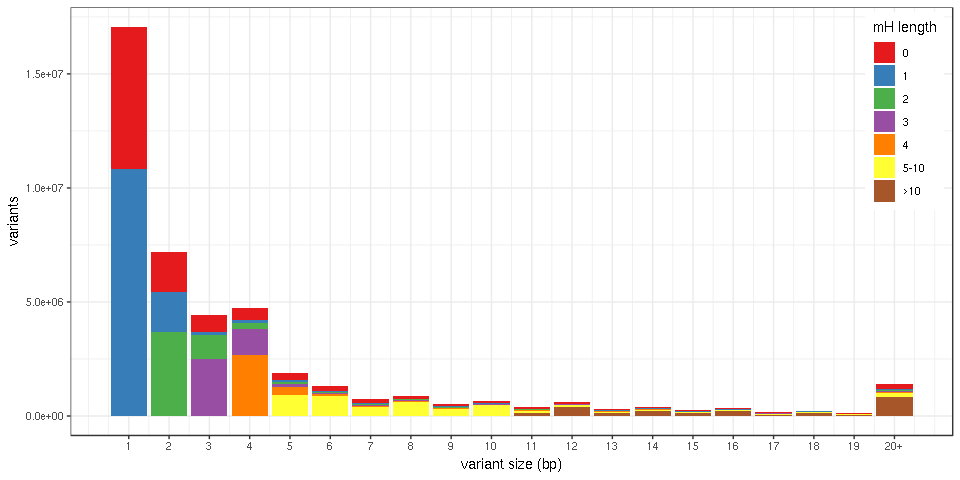

Figure sandbox
==============

First load the packages:

``` r
## For data manipulation
library(data.table) # good for big data
library(dplyr) # To manipulate/transform data.frames
library(magrittr) # pipes (e.g. %>%)

## For graphs and tables
library(ggplot2)
library(knitr)

## Functions
winsor <- function(x, u=10){
  ## Winsorize: if larger than u, force value to u
  if(any(x>u)) x[x>u] = u
  x
}
```

Then we'll read the input TSV file (with 43M variants) using the `fread` function. This will create a *data.table* object which uses disk space rather than memory (if I understand correctly) so it's good for big data. To reduce the amount of data loaded in R, let's only load some specific columns (using `select=`).

``` r
## Read the first row (headers) to remind us the order of each column
read.table('../scripts-dbSNP-ClinVar/mhcut-dbsnp-clinvar-deletion-variants.tsv.gz', nrows=1)
```

    ##    V1    V2  V3 V4  V5     V6       V7 V8 V9     V10    V11      V12   V13
    ## 1 chr start end RS CAF TOPMED GENEINFO PM MC AF_EXAC AF_TGP ALLELEID CLNDN
    ##      V14     V15              V16        V17      V18     V19  V20 V21
    ## 1 CLNSIG DBVARID GENEINFO.ClinVar MC.ClinVar citation geneloc varL mhL
    ##    V22 V23  V24       V25    V26     V27    V28    V29 V30    V31     V32
    ## 1 mh1L hom nbMM mhMaxCons mhDist mh1Dist MHseq1 MHseq2  GC pamMot pamUniq
    ##           V33          V34          V35
    ## 1 guidesNoNMH guidesMinNMH max2cutsDist

``` r
## Import variants and colums varL, mhL, mh1L, pamMot and pamUniq
var = fread('gunzip -c ../scripts-dbSNP-ClinVar/mhcut-dbsnp-clinvar-deletion-variants.tsv.gz',
            select=c(20:22,31,32))
```

This takes about 1 min. Now the `var` object is a *data.table* with 43M values. Before feeding this to ggplot2, the most efficient is to compute the summary statistics using the `data.table` functions, then convert to *data.frame* and call ggplot.

Histogram of the variant size colored by MH length
--------------------------------------------------

Here we want the number of variants for each pair of {variant size, MH length}, the *data.table* command is:

``` r
varmh = var[,.N, by=.(varL, mhL)]
head(varmh)
```

    ##    varL mhL       N
    ## 1:    6   6  609758
    ## 2:    5   4  323425
    ## 3:    1   0 6241188
    ## 4:   19  19   13646
    ## 5:    5   0  309849
    ## 6:   13  13   69665

``` r
nrow(varmh)
```

    ## [1] 3072

This is now just ~3,000 values so we can convert to *data.frame* and use dplyr/ggplot to make the graph.

``` r
varmh.df = as.data.frame(varmh)

## Create a new column with the mhL class
varmh.df$mhL.class = cut(varmh.df$mhL, breaks=c(-1,0,1,2,3,4,10,Inf),
                         labels=c(0:4,'5-10','>10'))

## After winsorizing at varL 30, we compute the total number of variant in each class for each variant size using dplyr.
bar.df = varmh.df %>% mutate(varL=winsor(varL, 20)) %>%
    group_by(varL, mhL.class) %>% summarize(N=sum(N))
head(bar.df)
```

    ## # A tibble: 6 x 3
    ## # Groups:   varL [3]
    ##    varL mhL.class        N
    ##   <dbl> <fct>        <int>
    ## 1     1 0          6241188
    ## 2     1 1         10824944
    ## 3     2 0          1723247
    ## 4     2 1          1774571
    ## 5     2 2          3674728
    ## 6     3 0           714709

``` r
## Bar plot using ggplot2
ggplot(bar.df, aes(x=varL, y=N, fill=mhL.class)) + geom_bar(stat='identity') +
    theme_bw() + scale_fill_brewer(name='mH length', palette='Set1') +
    ylab('variants') + xlab('variant size (bp)') +
    scale_x_continuous(breaks=1:20, labels=c(1:19,'20+')) +
    theme(legend.position=c(.99,.99), legend.justification=c(1,1))
```



Wow, there are not that many variants with no micro-homology. I expected much more.

Just a safety check, are we really looking at ~43M variants?

``` r
sum(varmh.df$N)
```

    ## [1] 43567343

Yep.

Of note, there is a one-liner way of doing this using the power of pipes. It's a long line but can be read from left to right:

``` r
varmh %>% as.data.frame %>% mutate(mhL.class=cut(mhL,
                                                 breaks=c(-1,0,1,2,3,4,10,Inf),
                                                 labels=c(0:4,'5-10','>10')),
                                   varL=winsor(varL, 20)) %>%
    group_by(varL, mhL.class) %>% summarize(N=sum(N)) %>%
    ggplot(aes(x=varL, y=N, fill=mhL.class)) + geom_bar(stat='identity') +
    theme_bw() + scale_fill_brewer(name='mH length', palette='Set1') +
    ylab('variants') + xlab('variant size (bp)') +
    scale_x_continuous(breaks=1:20, labels=c(1:19,'20+')) +
    theme(legend.position=c(.99,.99), legend.justification=c(1,1))
```


Table for different filtering criteria
--------------------------------------

We want to know how many variants have:

1.  MH length &gt;= 3, `mhL>=3`.
2.  an available PAM, `pamMot>0`.
3.  with a unique protospacer, `pamUniq>0`.
4.  and with no nested MH, `nbNMH==0` in the guide file.

``` r
nb.mh3 = nrow(var[mhL>=3])
nb.mh3.pam = nrow(var[mhL>=3 & pamMot>0])
nb.mh3.pam.uniq = nrow(var[mhL>=3 & pamMot>0 & pamUniq>0])
```

For the last number we should look into the guides to make sure that we count guides that are both unique and with no nested MH.

``` r
## Import guides: columns chr/start/end/RS, mhL, pamMot, pamUniq and nbNMH
guides = fread('gunzip -c ../scripts-dbSNP-ClinVar/mhcut-dbsnp-clinvar-deletion-guides.tsv.gz',
               select=c(1:4,21,31,32,45))
nb.mh3.pam.uniq.nonmh = nrow(unique(guides[mhL>=3 & pamMot>0 & pamUniq>0 & nbNMH==0,
                                           .(chr, start, end, RS)]))
```

Formatted as a table:

``` r
ngg.sum = tibble(cas9='NGG', nb.mh3, nb.mh3.pam, nb.mh3.pam.uniq, nb.mh3.pam.uniq.nonmh)
kable(ngg.sum, format.args=list(big.mark=','))
```

| cas9 |      nb.mh3|  nb.mh3.pam|  nb.mh3.pam.uniq|  nb.mh3.pam.uniq.nonmh|
|:-----|-----------:|-----------:|----------------:|----------------------:|
| NGG  |  13,166,790|   2,386,722|        1,425,346|                780,609|

Now let's do the same for the xCas9 run. Because of the more flexible PAM we expect more "targetable" deletions.

``` r
var.x = fread('gunzip -c ../scripts-dbSNP-ClinVar/mhcut-dbsnp-clinvar-deletion-xCas9-variants.tsv.gz',
              select=c(20:22,31,32))
guides.x = fread('gunzip -c ../scripts-dbSNP-ClinVar/mhcut-dbsnp-clinvar-deletion-xCas9-guides.tsv.gz',
                 sel=c(1:4,21,31,32,45))

xcas9.sum = tibble(cas9='xCas9',
                   nb.mh3 = nrow(var.x[mhL>=3]),
                   nb.mh3.pam = nrow(var.x[mhL>=3 & pamMot>0]),
                   nb.mh3.pam.uniq = nrow(var.x[mhL>=3 & pamMot>0 & pamUniq>0]),
                   nb.mh3.pam.uniq.nonmh = nrow(unique(guides.x[mhL>=3 & pamMot>0 &
                                                                pamUniq>0 & nbNMH==0,
                                                                .(chr, start, end, RS)])))

rbind(ngg.sum, xcas9.sum) %>% kable(format.args=list(big.mark=','))
```

| cas9  |      nb.mh3|  nb.mh3.pam|  nb.mh3.pam.uniq|  nb.mh3.pam.uniq.nonmh|
|:------|-----------:|-----------:|----------------:|----------------------:|
| NGG   |  13,166,790|   2,386,722|        1,425,346|                780,609|
| xCas9 |  13,166,790|   8,964,375|        4,601,939|              3,360,482|
