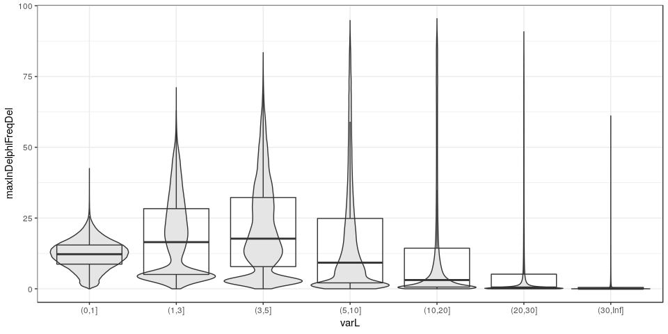
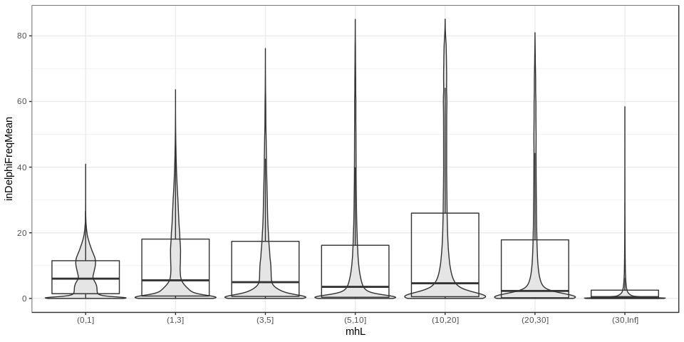
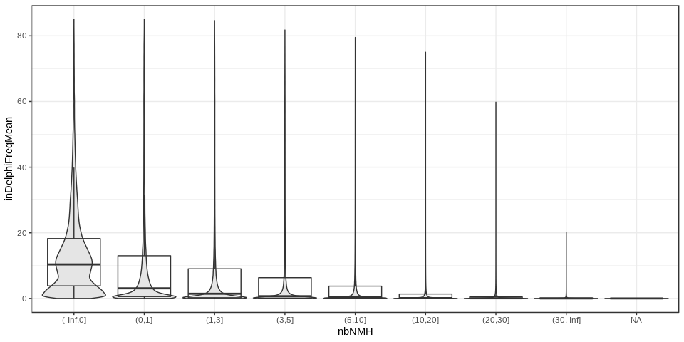
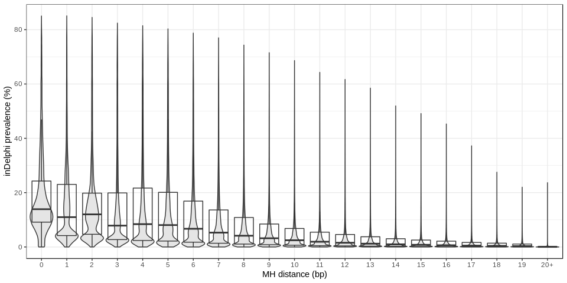
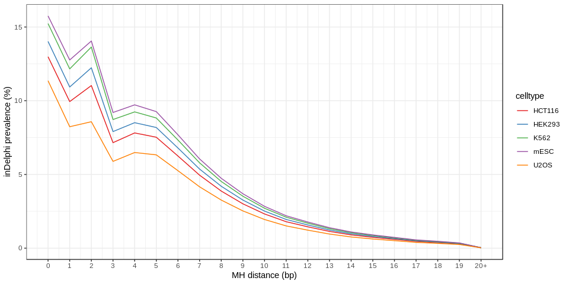

inDelphi exploration on the dnSNP-Clinvar data
==============================================

INTRO

Load packages and data
----------------------

First load the packages:

``` r
## For data manipulation
library(data.table) # good for big data
library(dplyr) # To manipulate/transform data.frames
library(magrittr) # pipes (e.g. %>%)
library(tidyr)

## For graphs and tables
library(ggplot2)
library(knitr)

## Functions
winsor <- function(x, u=10){
  ## Winsorize: if larger than u, force value to u
  if(any(x>u)) x[x>u] = u
  x
}
```

Then we’ll read the input TSV file for the guides using the `fread`
function. Of note multiple guides might be present for each variant in
the *guides* file but that is fine because we want to look at the
inDelphi prediction for each cut. This will create a *data.table* object
which uses disk space rather than memory (if I understand correctly) so
it’s good for big data. To reduce the amount of data loaded in R, let’s
only load some specific columns (using `select=`).

``` r
## Read the first row (headers) to remind us the order of each column
read.table('../scripts-dbSNP-ClinVar/mhcut-dbsnp-clinvar-deletion-indelphi5-guides.tsv.gz', nrows=1)
```

    ##    V1    V2  V3 V4  V5     V6       V7 V8 V9     V10    V11      V12   V13
    ## 1 chr start end RS CAF TOPMED GENEINFO PM MC AF_EXAC AF_TGP ALLELEID CLNDN
    ##      V14     V15              V16        V17      V18     V19  V20 V21
    ## 1 CLNSIG DBVARID GENEINFO.ClinVar MC.ClinVar citation geneloc varL mhL
    ##    V22 V23  V24       V25    V26     V27    V28    V29 V30    V31     V32
    ## 1 mh1L hom nbMM mhMaxCons mhDist mh1Dist MHseq1 MHseq2  GC pamMot pamUniq
    ##           V33          V34          V35                 V36
    ## 1 guidesNoNMH guidesMinNMH max2cutsDist maxInDelphiFreqmESC
    ##                   V37                   V38                   V39
    ## 1 maxInDelphiFreqU2OS maxInDelphiFreqHEK293 maxInDelphiFreqHCT116
    ##                   V40         V41    V42 V43 V44 V45     V46     V47
    ## 1 maxInDelphiFreqK562 protospacer pamSeq mm0 mm1 mm2 m1Dist1 m1Dist2
    ##       V48     V49   V50        V51      V52     V53     V54   V55    V56
    ## 1 mhDist1 mhDist2 nbNMH largestNMH nmhScore nmhSize nmhVarL nmhGC nmhSeq
    ##                V57              V58                V59                V60
    ## 1 inDelphiFreqmESC inDelphiFreqU2OS inDelphiFreqHEK293 inDelphiFreqHCT116
    ##                V61
    ## 1 inDelphiFreqK562

``` r
## Import variants and colums varL, mhL, mh1Dist, nbNMH, and the 5 inDelphi columns
gds = fread('gunzip -c ../scripts-dbSNP-ClinVar/mhcut-dbsnp-clinvar-deletion-indelphi5-guides.tsv.gz',
            select=c(20, 21, 27, 50, 57:61))
gds.df = as.data.frame(gds)
```

Average predicted frequency across cell types
---------------------------------------------

``` r
gds.df$inDelphiFreqMean = rowMeans(as.matrix(gds.df[, 5:9]))
gds.df %>% head %>% kable
```

|  varL|  mhL|  mh1Dist|  nbNMH|  inDelphiFreqmESC|  inDelphiFreqU2OS|  inDelphiFreqHEK293|  inDelphiFreqHCT116|  inDelphiFreqK562|  inDelphiFreqMean|
|-----:|----:|--------:|------:|-----------------:|-----------------:|-------------------:|-------------------:|-----------------:|-----------------:|
|    21|    5|       16|      4|             6.057|             3.046|               5.892|               5.511|             6.531|            5.4074|
|    21|    5|       16|      3|             7.865|             6.837|               7.944|               7.703|             8.015|            7.6728|
|    21|    5|       16|      3|             7.883|             6.853|               7.962|               7.721|             8.033|            7.6904|
|    21|    5|       16|      6|             1.101|             0.842|               1.043|               0.945|             1.046|            0.9954|
|     5|    1|        4|      0|             1.549|             0.785|               1.520|               1.422|             1.684|            1.3920|
|     5|    1|        4|      0|             2.246|             1.955|               2.266|               2.192|             2.289|            2.1896|

Predicted frequency and variant size
------------------------------------

``` r
gds.df %>% mutate(varL=cut(varL, breaks=c(0,1,3,5,10,20,30,Inf))) %>%
  ggplot(aes(x=varL, y=inDelphiFreqMean)) +
  geom_violin(scale='width', fill='grey90') + geom_boxplot(alpha=0) + 
  theme_bw()
```



The average predicted frequencies tend to decrease when the variant gets
too big (&gt;10-20bp). However, the variance increases with some large
variants reaching high predicted frequencies.

Predicted frequency and MH length
---------------------------------

``` r
gds.df %>% mutate(mhL=cut(mhL, breaks=c(0,1,3,5,10,20,30,Inf))) %>%
  ggplot(aes(x=mhL, y=inDelphiFreqMean)) +
  geom_violin(scale='width', fill='grey90') + geom_boxplot(alpha=0) + 
  theme_bw()
```



It’s quite similar across different MH levels.

Predicted frequency and nested MH
---------------------------------

``` r
gds.df %>% 
  mutate(nbNMH=cut(nbNMH, breaks=c(-Inf, 0,1,3,5,10,20,30,Inf))) %>%
  ggplot(aes(x=nbNMH, y=inDelphiFreqMean)) +
  geom_violin(scale='width', fill='grey90') + geom_boxplot(alpha=0) + 
  theme_bw()
```



The highest predicted frequency is nicely anti-correlated with the
number of nested MH for the guide which have the least amount of nested
MH. That’s good because that was one estimate used to get an idea of
efficiency.

Predicted frequency and distance between MH
-------------------------------------------

``` r
gds.df %>% 
  mutate(mh1Dist=factor(winsor(mh1Dist, 20))) %>%
  ggplot(aes(x=mh1Dist, y=inDelphiFreqMean)) +
  geom_violin(scale='width', fill='grey90') + geom_boxplot(alpha=0) + 
  theme_bw() + 
  xlab("MH distance (bp)") + ylab("median inDelphi prevalence (%)")+
  scale_x_discrete(breaks=c(0:20), labels=c(0:19,"20+")) +
  scale_y_continuous(name="inDelphi prevalence (%)")
```



``` r
mhdist.med = gds.df %>% mutate(mh1Dist=winsor(mh1Dist, 20)) %>%
  group_by(mh1Dist) %>% summarize_all(median, na.rm=TRUE)

mhdist.med %>% gather(celltype, freq, -mh1Dist, -varL, -mhL, -nbNMH, -inDelphiFreqMean) %>%
  mutate(celltype=gsub('inDelphiFreq','',celltype)) %>% 
  ggplot(aes(x=mh1Dist, y=freq, colour=celltype)) +
  geom_line() + scale_colour_brewer(palette='Set1') + 
  theme_bw() + 
  xlab("MH distance (bp)") + ylab("median inDelphi prevalence (%)")+
  scale_x_continuous(breaks=c(0:20), labels=c(0:19,"20+")) +
  scale_y_continuous(name="inDelphi prevalence (%)")
```


