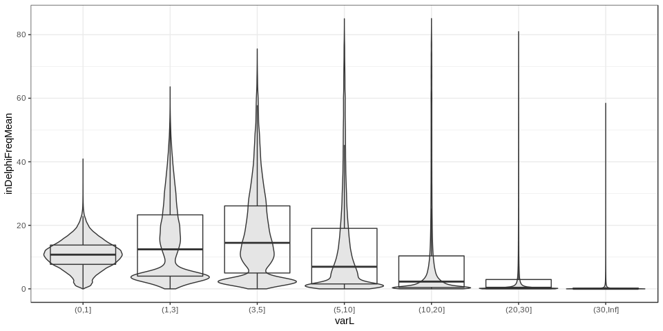

inDelphi exploration on the dnSNP-Clinvar data
==============================================

INTRO

Load packages and data
----------------------

First load the packages:

``` r
## For data manipulation
library(data.table) # good for big data
library(dplyr) # To manipulate/transform data.frames
library(magrittr) # pipes (e.g. %>%)

## For graphs and tables
library(ggplot2)
library(knitr)

## Functions
winsor <- function(x, u=10){
  ## Winsorize: if larger than u, force value to u
  if(any(x>u)) x[x>u] = u
  x
}
```

Then we'll read the input TSV file (with 43M variants) using the `fread` function. This will create a *data.table* object which uses disk space rather than memory (if I understand correctly) so it's good for big data. To reduce the amount of data loaded in R, let's only load some specific columns (using `select=`).

``` r
## Read the first row (headers) to remind us the order of each column
read.table('../scripts-dbSNP-ClinVar/mhcut-dbsnp-clinvar-deletion-indelphi-variants.tsv.gz', nrows=1)
```

    ##    V1    V2  V3 V4  V5     V6       V7 V8 V9     V10    V11      V12   V13
    ## 1 chr start end RS CAF TOPMED GENEINFO PM MC AF_EXAC AF_TGP ALLELEID CLNDN
    ##      V14     V15              V16        V17      V18     V19  V20 V21
    ## 1 CLNSIG DBVARID GENEINFO.ClinVar MC.ClinVar citation geneloc varL mhL
    ##    V22 V23  V24       V25    V26     V27    V28    V29 V30    V31     V32
    ## 1 mh1L hom nbMM mhMaxCons mhDist mh1Dist MHseq1 MHseq2  GC pamMot pamUniq
    ##           V33          V34          V35                V36
    ## 1 guidesNoNMH guidesMinNMH max2cutsDist maxInDelphiFreqDel
    ##                   V37
    ## 1 maxInDelphiFreqSize

``` r
## Import variants and colums varL, mhL, guidesMinNMH, maxInDelphiFreqDel, maxInDelphiFreqSize
var = fread('gunzip -c ../scripts-dbSNP-ClinVar/mhcut-dbsnp-clinvar-deletion-indelphi-variants.tsv.gz',
            select=c(20, 21, 34, 36, 37))
```

This takes about 1 min. Now the `var` object is a *data.table* with 43M values.

Let's keep only variants whose inDelphi columns are not *NA*.

``` r
var = var[!is.na(maxInDelphiFreqDel)]
head(var)
```

    ##    varL mhL guidesMinNMH maxInDelphiFreqDel maxInDelphiFreqSize
    ## 1:    1   1            0             16.716              29.055
    ## 2:   31   5            3              0.068               0.117
    ## 3:   22   5            5              0.919               1.787
    ## 4:    3   3            0             27.048              27.048
    ## 5:    2   1            0              4.407               4.407
    ## 6:    2   2            0             33.278              33.278

``` r
nrow(var)
```

    ## [1] 3045456

This is now "just" 3045456 values so we can convert to *data.frame* and use dplyr/ggplot to make the graph.

Prediction per deletion or per size
-----------------------------------

``` r
var.df = as.data.frame(var)

ggplot(var.df, aes(x=maxInDelphiFreqSize-maxInDelphiFreqDel)) +
  geom_histogram() + theme_bw()
```


``` r
ggplot(var.df, aes(x=maxInDelphiFreqDel, y=maxInDelphiFreqSize, fill=log10(..count..))) +
  geom_bin2d(colour='black') + scale_fill_gradient(low='grey90', high='black') + 
  theme_bw() + geom_abline(linetype=2)
```


Is the difference between the per-deletion and per-size metric correlated with variant size or other features?

``` r
var.df %>% mutate(indelphi.diff=cut(maxInDelphiFreqSize-maxInDelphiFreqDel,
                                    breaks=c(0,5,10,30,50,100), include.lowest=TRUE)) %>% 
  ggplot(aes(x=indelphi.diff, y=winsor(varL, 50), fill=maxInDelphiFreqDel==0)) +
  geom_violin(scale='width') + geom_boxplot(alpha=0) + 
  theme_bw()
```


``` r
var.df %>% mutate(indelphi.diff=cut(maxInDelphiFreqSize-maxInDelphiFreqDel,
                                    breaks=c(0,5,10,30,50,100), include.lowest=TRUE)) %>% 
  ggplot(aes(x=indelphi.diff, y=winsor(mhL, 50), fill=maxInDelphiFreqDel==0)) +
  geom_violin(scale='width') + geom_boxplot(alpha=0) + 
  theme_bw()
```


``` r
var.df %>% mutate(indelphi.diff=cut(maxInDelphiFreqSize-maxInDelphiFreqDel,
                                    breaks=c(0,5,10,30,50,100), include.lowest=TRUE)) %>% 
  ggplot(aes(x=indelphi.diff, y=winsor(guidesMinNMH, 20), fill=maxInDelphiFreqDel==0)) +
  geom_violin(scale='width') + geom_boxplot(alpha=0) + 
  theme_bw()
```


It looks like the variant with much higher per-size frequency than per-variant frequency are:

1.  of medium size, e.g. ~10bp.
2.  with good MH.
3.  with some nested MH.

That kind of makes sense: there are nested MH that maybe create a frequent deletions of similar size but not exactly the one we want.

However, when the per-deletion frequency is exactly 0, the patterns are a bit different and for those it might be a problem of matching inDelphi's output with our deletion.

Predicted frequency and variant size
------------------------------------

``` r
var.df %>% mutate(varL=cut(varL, breaks=c(0,1,3,5,10,20,30,Inf))) %>%
  ggplot(aes(x=varL, y=maxInDelphiFreqDel)) +
  geom_violin(scale='width', fill='grey90') + geom_boxplot(alpha=0) + 
  theme_bw()
```



``` r
var.df %>% mutate(varL=cut(varL, breaks=c(0,1,3,5,10,20,30,Inf))) %>%
  ggplot(aes(x=varL, y=maxInDelphiFreqSize)) +
  geom_violin(scale='width', fill='grey90') + geom_boxplot(alpha=0) + 
  theme_bw()
```


The average predicted frequencies tend to decrease when the variant gets too big (&gt;10-20bp).

Predicted frequency and MH length
---------------------------------

``` r
var.df %>% mutate(mhL=cut(mhL, breaks=c(0,1,3,5,10,20,30,Inf))) %>%
  ggplot(aes(x=mhL, y=maxInDelphiFreqDel)) +
  geom_violin(scale='width', fill='grey90') + geom_boxplot(alpha=0) + 
  theme_bw()
```


``` r
var.df %>% mutate(mhL=cut(mhL, breaks=c(0,1,3,5,10,20,30,Inf))) %>%
  ggplot(aes(x=mhL, y=maxInDelphiFreqSize)) +
  geom_violin(scale='width', fill='grey90') + geom_boxplot(alpha=0) + 
  theme_bw()
```


However it's quite similar across different MH levels.

Predicted frequency and nested MH
---------------------------------

``` r
var.df %>% filter(!is.na(guidesMinNMH)) %>%
  mutate(guidesMinNMH=cut(guidesMinNMH, breaks=c(-Inf, 0,1,3,5,10,20,30,Inf))) %>%
  ggplot(aes(x=guidesMinNMH, y=maxInDelphiFreqDel)) +
  geom_violin(scale='width', fill='grey90') + geom_boxplot(alpha=0) + 
  theme_bw()
```


``` r
var.df %>% filter(!is.na(guidesMinNMH)) %>%
  mutate(guidesMinNMH=cut(guidesMinNMH, breaks=c(-Inf, 0,1,3,5,10,20,30,Inf))) %>%
  ggplot(aes(x=guidesMinNMH, y=maxInDelphiFreqSize)) +
  geom_violin(scale='width', fill='grey90') + geom_boxplot(alpha=0) + 
  theme_bw()
```


The highest predicted frequency is nicely anti-correlated with the number of nested MH for the guide which have the least amount of nested MH. That's good because that was one estimate used to get an idea of efficiency.
