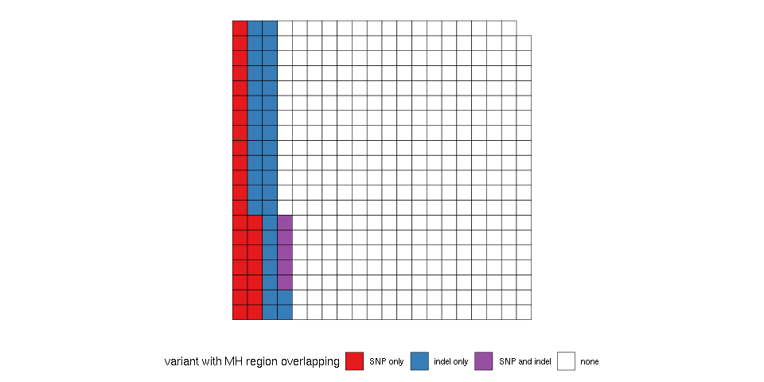

Overlap known SNPs with MHcut's output
======================================

``` r
## For data manipulation
library(data.table)  # good for big data
library(dplyr)  # To manipulate/transform data.frames
library(magrittr)  # pipes (e.g. %>%)
## For tables
library(knitr)

library(ggplot2)
library(ggwaffle)
library(RColorBrewer)
library(GenomicRanges)

## Read the first row (headers) to remind us the order of each column
var = read.table("../scripts-dbSNP-ClinVar/mhcut-dbsnp-clinvar-deletion-variants.tsv.gz", 
    nrows = 1)
var = fread("gunzip -c ../scripts-dbSNP-ClinVar/mhcut-dbsnp-clinvar-deletion-variants.tsv.gz", 
    select = c(1:4, 20, 21, 23, 24))
head(var)
```

    ##     chr start   end         RS varL flank mhL mh1L
    ## 1: chr1 10109 10114 1377973775    6     2   6    6
    ## 2: chr1 10110 10114 1462685959    5     1   5    1
    ## 3: chr1 10120 10120 1156821933    1     2   0    0
    ## 4: chr1 10129 10147 1457723673   19     2  19   19
    ## 5: chr1 10132 10132 1289482855    1     2   0    0
    ## 6: chr1 10133 10137 1390118706    5     2   0    0

Subset of variants
------------------

Let's work with a random subset of 100K variants. This should be enough to produce good estimates.

Let's say we are interested in variants with at least 3 bp of mh1L.

``` r
var = var[sample.int(nrow(var), 1e+05)]
var.s = as.data.frame(subset(var, mh1L > 2))
var.s %<>% mutate(id = paste(chr, start, end, RS, sep = "_"))
```

Micro-homology regions
----------------------

``` r
fl1 = with(var.s, GRanges(var.s$chr, IRanges(ifelse(flank == 1, start - mhL, 
    start), ifelse(flank == 1, start, start + mhL)), id = id, flank = 1))
fl2 = with(var.s, GRanges(var.s$chr, IRanges(ifelse(flank == 1, end - mhL, end), 
    ifelse(flank == 1, end, end + mhL)), id = id, flank = 2))
fl.gr = c(fl1, fl2)
```

Common SNPs in the human population
-----------------------------------

``` r
snps = fread("gunzip -c ../scripts-dbSNP-ClinVar/snp151Common-formatted.tsv.gz")
snps = as.data.frame(snps)
colnames(snps) = c("chr", "start", "end", "RS", "vtype", "freq")
dim(snps)
```

    ## [1] 15175044        6

``` r
snps = subset(snps, !(RS %in% paste0("rs", var.s$RS)))
dim(snps)
```

    ## [1] 15174553        6

``` r
snps = makeGRangesFromDataFrame(snps, keep.extra.columns = TRUE)
```

Overlap
-------

``` r
fl.gr$snp.ol = overlapsAny(fl.gr, subset(snps, vtype == "single"))
fl.gr$indel.ol = overlapsAny(fl.gr, subset(snps, vtype == "deletion" | vtype == 
    "insertion"))

fl.id = fl.gr %>% as.data.frame %>% group_by(id) %>% summarize(snp.ol = any(snp.ol), 
    indel.ol = any(indel.ol)) %>% mutate(class = ifelse(snp.ol, "SNP only", 
    "none"), class = ifelse(indel.ol, "indel only", class), class = ifelse(snp.ol & 
    indel.ol, "SNP and indel", class), classf = factor(class, levels = c("SNP only", 
    "indel only", "SNP and indel", "none"))) %>% arrange(classf)

fl.id %>% group_by(classf) %>% summarize(n = n()) %>% ungroup %>% mutate(prop = n/sum(n)) %>% 
    select(-n) %>% kable
```

| classf        |       prop|
|:--------------|----------:|
| SNP only      |  0.0677609|
| indel only    |  0.0885415|
| SNP and indel |  0.0129050|
| none          |  0.8307926|

``` r
prop.ss = 400/nrow(fl.id)
waffle_data <- fl.id %>% group_by(classf) %>% sample_n(round(n() * prop.ss)) %>% 
    waffle_iron(aes_d(group = classf), rows = 20) %>% mutate(group = factor(group, 
    levels = 1:4, labels = c("SNP only", "indel only", "SNP and indel", "none")))

w.pal = c(brewer.pal(8, "Set1")[c(1, 2, 4)], "white")

ggplot(waffle_data, aes(x, y, fill = group)) + geom_waffle(color = "black", 
    size = 0.2) + coord_equal() + scale_fill_manual(name = "variant with MH region overlapping", 
    values = w.pal) + theme_waffle() + theme(axis.title.x = element_blank(), 
    axis.title.y = element_blank(), legend.position = "bottom")
```


