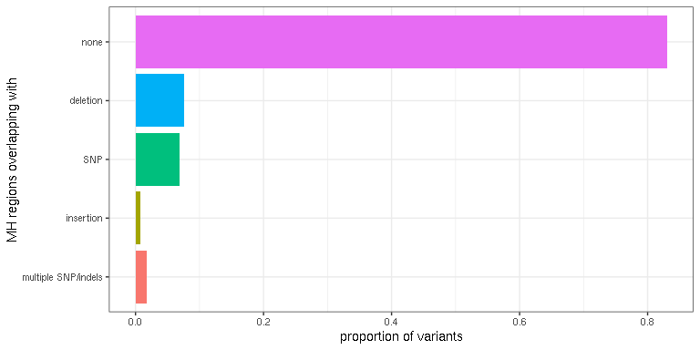
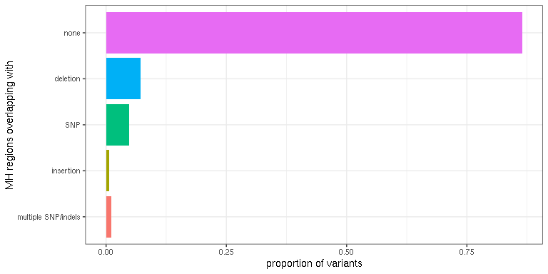
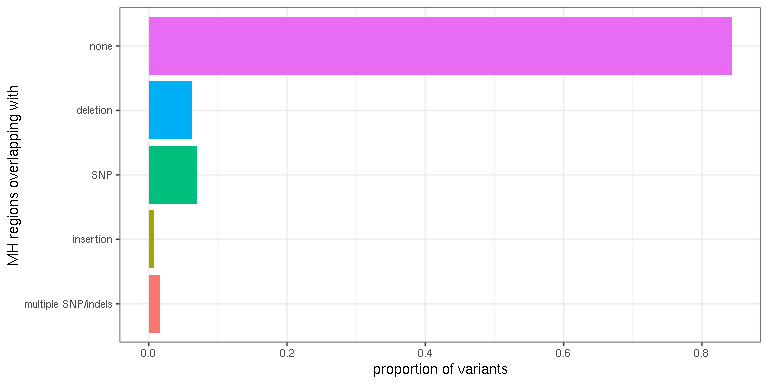

Overlap known SNPs with MHcut's output
======================================

Our analysis is based on the micro-homology (MH) derived from the reference sequence of the genome. Individuals might have slightly different sequences, for example because of the presence of SNPs and indels.

-   Do common SNPs/indels overlap with the regions of MH?
-   How many of the variants with MH could be affected by common SNPs/indels?

``` r
## For data manipulation
library(data.table)  # good for big data
library(dplyr)  # To manipulate/transform data.frames
library(magrittr)  # pipes (e.g. %>%)
## For tables
library(knitr)

library(ggplot2)
library(ggwaffle)
library(RColorBrewer)
library(GenomicRanges)

## Read the first row (headers) to remind us the order of each column
var = read.table("../scripts-dbSNP-ClinVar/mhcut-dbsnp-clinvar-deletion-variants.tsv.gz", 
    nrows = 1)
var = fread("gunzip -c ../scripts-dbSNP-ClinVar/mhcut-dbsnp-clinvar-deletion-variants.tsv.gz", 
    select = c(1:4, 20, 21, 23, 24))
head(var)
```

    ##     chr start   end         RS varL flank mhL mh1L
    ## 1: chr1 10109 10114 1377973775    6     2   6    6
    ## 2: chr1 10110 10114 1462685959    5     1   5    1
    ## 3: chr1 10120 10120 1156821933    1     2   0    0
    ## 4: chr1 10129 10147 1457723673   19     2  19   19
    ## 5: chr1 10132 10132 1289482855    1     2   0    0
    ## 6: chr1 10133 10137 1390118706    5     2   0    0

Subset of variants
------------------

Let's work with a random subset of 100K variants. This should be enough to produce good estimates.

Let's say we are interested in variants with at least 3 bp of mh1L.

``` r
var = var[sample.int(nrow(var), 1e+05)]
var.s = as.data.frame(subset(var, mh1L > 2))
var.s %<>% mutate(id = paste(chr, start, end, RS, sep = "_"))
```

Micro-homology regions
----------------------

The MH regions are either in the inner-outer or outer-inner configurations. Using the column *flank* we retrieve the correct MH regions, two for each variant.

``` r
fl1 = with(var.s, GRanges(var.s$chr, IRanges(ifelse(flank == 1, start - mhL, 
    start), ifelse(flank == 1, start, start + mhL)), id = id, flank = 1, varL = varL))
fl2 = with(var.s, GRanges(var.s$chr, IRanges(ifelse(flank == 1, end - mhL, end), 
    ifelse(flank == 1, end, end + mhL)), id = id, flank = 2, varL = varL))
fl.gr = c(fl1, fl2)
```

Common SNPs in the human population
-----------------------------------

Common SNPs and indels are downloaded the UCSC database and formatted using [`formatSNPcommon.py`](../scripts-dbSNP-ClinVar/formatSNPcommon.py).

Using the RS id, we remove the variants with MH because they obviously overlap with MH regions. We want to know if other variants overlap with the MH regions.

``` r
snps = fread("gunzip -c ../scripts-dbSNP-ClinVar/snp151Common-formatted.tsv.gz")
snps = as.data.frame(snps)
colnames(snps) = c("chr", "start", "end", "RS", "vtype", "freq")
nrow(snps)
```

    ## [1] 15175044

``` r
snps = snps %>% filter(!(RS %in% paste0("rs", var.s$RS))) %>% mutate(varL = end - 
    start)
nrow(snps)
```

    ## [1] 15174564

``` r
snps = makeGRangesFromDataFrame(snps, keep.extra.columns = TRUE)
```

Overlap SNP/indels &gt; 1% MAF with MH regions
----------------------------------------------

Let's compute the proportion of variants whose MH regions overlap a SNP, an insertion/deletion, or a combination of those.

``` r
snps.01 = subset(snps, freq >= 0.01)
fl.gr$snp.ol = overlapsAny(fl.gr, subset(snps.01, vtype == "single"))
fl.gr$del.ol = overlapsAny(fl.gr, subset(snps.01, vtype == "deletion"))
fl.gr$ins.ol = overlapsAny(fl.gr, subset(snps.01, vtype == "insertion"))

fl.id = fl.gr %>% as.data.frame %>% group_by(id) %>% summarize(snp.ol = any(snp.ol), 
    del.ol = any(del.ol), ins.ol = any(ins.ol)) %>% mutate(class = ifelse(snp.ol, 
    "SNP", "none"), class = ifelse(del.ol, "deletion", class), class = ifelse(ins.ol, 
    "insertion", class), class = ifelse(snp.ol + del.ol + ins.ol > 1, "multiple SNP/indels", 
    class), classf = factor(class, levels = c("multiple SNP/indels", "insertion", 
    "SNP", "deletion", "none"))) %>% arrange(classf)

fl.id %>% group_by(classf) %>% summarize(n = n()) %>% ungroup %>% mutate(prop = n/sum(n)) %>% 
    select(-n) %>% kable
```

| classf              |       prop|
|:--------------------|----------:|
| multiple SNP/indels |  0.0174272|
| insertion           |  0.0075077|
| SNP                 |  0.0691640|
| deletion            |  0.0759715|
| none                |  0.8299296|

``` r
fl.id %>% group_by(classf) %>% summarize(n = n()) %>% ungroup %>% mutate(prop = n/sum(n)) %>% 
    ggplot(aes(x = classf, y = prop, fill = classf)) + geom_bar(stat = "identity") + 
    theme_bw() + coord_flip() + ylab("proportion of variants") + xlab("MH regions overlapping with") + 
    guides(fill = FALSE)
```



Overlap SNP/indels &gt; 5% MAF with MH regions
----------------------------------------------

Same but using slightly more frequent variants (MAF&gt;5%)

``` r
snps.05 = subset(snps, freq >= 0.05)
fl.gr$snp.ol = overlapsAny(fl.gr, subset(snps.05, vtype == "single"))
fl.gr$del.ol = overlapsAny(fl.gr, subset(snps.05, vtype == "deletion"))
fl.gr$ins.ol = overlapsAny(fl.gr, subset(snps.05, vtype == "insertion"))

fl.id = fl.gr %>% as.data.frame %>% group_by(id) %>% summarize(snp.ol = any(snp.ol), 
    del.ol = any(del.ol), ins.ol = any(ins.ol)) %>% mutate(class = ifelse(snp.ol, 
    "SNP", "none"), class = ifelse(del.ol, "deletion", class), class = ifelse(ins.ol, 
    "insertion", class), class = ifelse(snp.ol + del.ol + ins.ol > 1, "multiple SNP/indels", 
    class), classf = factor(class, levels = c("multiple SNP/indels", "insertion", 
    "SNP", "deletion", "none"))) %>% arrange(classf)

fl.id %>% group_by(classf) %>% summarize(n = n()) %>% ungroup %>% mutate(prop = n/sum(n)) %>% 
    select(-n) %>% kable
```

| classf              |       prop|
|:--------------------|----------:|
| multiple SNP/indels |  0.0101918|
| insertion           |  0.0060684|
| SNP                 |  0.0478080|
| deletion            |  0.0713813|
| none                |  0.8645505|

``` r
fl.id %>% group_by(classf) %>% summarize(n = n()) %>% ungroup %>% mutate(prop = n/sum(n)) %>% 
    ggplot(aes(x = classf, y = prop, fill = classf)) + geom_bar(stat = "identity") + 
    theme_bw() + coord_flip() + ylab("proportion of variants") + xlab("MH regions overlapping with") + 
    guides(fill = FALSE)
```



Filtering out potential duplicates of the deletion of interest
--------------------------------------------------------------

Sometimes the same variant is duplicated in the database and has two RS ids. That means that sometimes the variant of interest is still in the set of SNP/indels that we compare the MH regions with. Obviously they will overlap and would inflate the estimation of "what other variants would disrupt the MH-based repair". To investigate if that's the case, let's remove deletions of the same size as the deletion of interest that they overlap with.

``` r
snps.01 = subset(snps, freq >= 0.01)
fl.gr$snp.ol = overlapsAny(fl.gr, subset(snps.01, vtype == "single"))
fl.gr$ins.ol = overlapsAny(fl.gr, subset(snps.01, vtype == "insertion"))

## Compare size of the overlapping and filter out if same
del.01 = subset(snps.01, vtype == "deletion")
ol.df = findOverlaps(fl.gr, del.01) %>% as.data.frame %>% mutate(qs = fl.gr$varL[queryHits], 
    ss = del.01$varL[subjectHits]) %>% filter(qs != ss)
fl.gr$del.ol = FALSE
fl.gr$del.ol[unique(ol.df$queryHits)] = TRUE


fl.id = fl.gr %>% as.data.frame %>% group_by(id) %>% summarize(snp.ol = any(snp.ol), 
    del.ol = any(del.ol), ins.ol = any(ins.ol)) %>% mutate(class = ifelse(snp.ol, 
    "SNP", "none"), class = ifelse(del.ol, "deletion", class), class = ifelse(ins.ol, 
    "insertion", class), class = ifelse(snp.ol + del.ol + ins.ol > 1, "multiple SNP/indels", 
    class), classf = factor(class, levels = c("multiple SNP/indels", "insertion", 
    "SNP", "deletion", "none"))) %>% arrange(classf)

fl.id %>% group_by(classf) %>% summarize(n = n()) %>% ungroup %>% mutate(prop = n/sum(n)) %>% 
    select(-n) %>% kable
```

| classf              |       prop|
|:--------------------|----------:|
| multiple SNP/indels |  0.0158323|
| insertion           |  0.0080523|
| SNP                 |  0.0702143|
| deletion            |  0.0631346|
| none                |  0.8427666|

``` r
fl.id %>% group_by(classf) %>% summarize(n = n()) %>% ungroup %>% mutate(prop = n/sum(n)) %>% 
    ggplot(aes(x = classf, y = prop, fill = classf)) + geom_bar(stat = "identity") + 
    theme_bw() + coord_flip() + ylab("proportion of variants") + xlab("MH regions overlapping with") + 
    guides(fill = FALSE)
```



The numbers don't change much: the duplicates have only a minor effect on these numbers.
