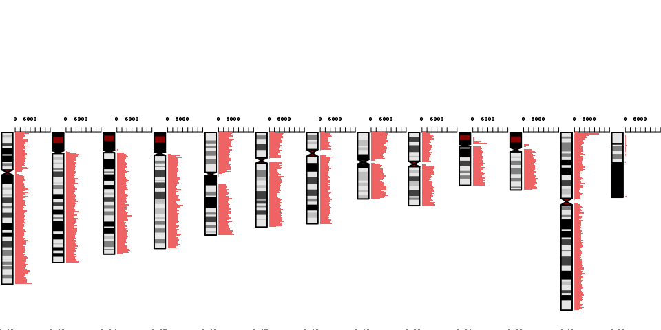
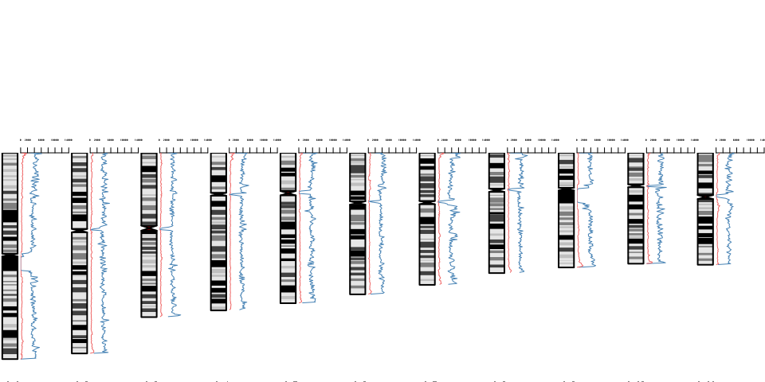

Chromosome view of the variant density
======================================

``` r
## For data manipulation
library(data.table)
library(dplyr)
library(magrittr)

## For graphs and tables
library(ggplot2)
library(knitr)

## Functions
winsor <- function(x, u = 10) {
    if (any(x > u)) 
        x[x > u] = u
    x
}
```

We load the coordinate columnd and the MH columns that we want to use for filtering (e.g. mhL and mh1L).

``` r
## read.table('../data/mhcut-dbsnp-clinvar-deletion-variants.tsv.gz',
## nrows=1)
var = fread("gunzip -c ../data/mhcut-dbsnp-clinvar-deletion-variants.tsv.gz", 
    select = c(1:3, 21:22, 29))
setkey(var, chr)
```

Variant density
---------------

For example, density of variants with `mh1L>2` in region of 1 Mbp. And also the density of variants with `mh1L>2` and `pamUniq>0`.

``` r
## source('https://bioconductor.org/biocLite.R')
## biocLite('BSgenome.Hsapiens.UCSC.hg38')
library(BSgenome.Hsapiens.UCSC.hg38)
library(GenomicRanges)
```

First let's prepare 1 Mbp regions in the human genome.

``` r
bin.gr = tileGenome(seqlengths(BSgenome.Hsapiens.UCSC.hg38), tilewidth = 1000000)
bin.gr = do.call(c, bin.gr)
```

Now count how many variants overlap each 1 Mbp region.

``` r
## We want one column for mh1L>2 and a sceond one for mh1L>2 AND pamUniq>0
var.filt = var[mh1L > 2, ]
var.filt2 = var[mh1L > 2 & pamUniq > 0, ]
## Separately per chromosome to reduce the memory footprint
gr.l = lapply(paste0("chr", c(1:22, "X", "Y")), function(chrom) {
    var.gr = makeGRangesFromDataFrame(var.filt[chrom, ])
    var2.gr = makeGRangesFromDataFrame(var.filt2[chrom, ])
    bin.chr = bin.gr[which(seqnames(bin.gr) == chrom)]
    bin.chr$nb.var = countOverlaps(bin.chr, var.gr)
    bin.chr$nb.var2 = countOverlaps(bin.chr, var2.gr)
    bin.chr
})

## Merge the chromosomes
gr = do.call(c, gr.l)
head(gr)
```

    ## GRanges object with 6 ranges and 2 metadata columns:
    ##       seqnames             ranges strand |    nb.var   nb.var2
    ##          <Rle>          <IRanges>  <Rle> | <integer> <integer>
    ##   [1]     chr1 [      1,  999778]      * |      2741       311
    ##   [2]     chr1 [ 999779, 1999556]      * |      5969      1093
    ##   [3]     chr1 [1999557, 2999333]      * |      3956       706
    ##   [4]     chr1 [2999334, 3999111]      * |      4252       942
    ##   [5]     chr1 [3999112, 4998889]      * |      3916       327
    ##   [6]     chr1 [4998890, 5998666]      * |      4010       379
    ##   -------
    ##   seqinfo: 455 sequences from an unspecified genome

On average 3479 variants per Mbp for variants with `mh1L>2`, and 3479 variants per Mbp for variants with `mh1L>2` and `pamUniq>0`.

IdeoViz package
---------------

Histogram version using only the column for `mh1L>2` variants.

``` r
## source("https://bioconductor.org/biocLite.R")
## biocLite("IdeoViz")
library(IdeoViz)

ideo <- getIdeo("hg38")

plotOnIdeo(chrom = paste0('chr', 1:11),
           ideoTable = ideo,
           values_GR = gr,
           value_cols = colnames(mcols(gr)),
           col = 'indianred2',
           addScale = F,
           val_range=c(0, max(gr$nb.var)),
           ## plotType='lines',
           plotType='rect',
           ## plot_title = paste("Differrence between", gsub(".coverage","",fileA), gsub(".coverage","",fileB), "bin",windows_size),
           cex.axis = 0.3,
           chromName_cex = .6,
           vertical = T)
```

    ## Plot chromosome done

    ## Plot chromosome done

    ## Plot chromosome done

    ## Plot chromosome done

    ## Plot chromosome done

    ## Plot chromosome done

    ## Plot chromosome done

    ## Plot chromosome done

    ## Plot chromosome done

    ## Plot chromosome done

    ## Plot chromosome done


``` r
plotOnIdeo(chrom = paste0('chr', c(12:22, 'X', 'Y')),
           ideoTable = ideo,
           values_GR = gr,
           value_cols = colnames(mcols(gr)),
           col = 'indianred2',
           addScale = F,
           val_range=c(0, max(gr$nb.var)),
           ## plotType='lines',
           plotType='rect',
           ## plot_title = paste("Differrence between", gsub(".coverage","",fileA), gsub(".coverage","",fileB), "bin",windows_size),
           cex.axis = 0.8,
           chromName_cex = 0.6,
           vertical = T)
```

    ## Plot chromosome done

    ## Plot chromosome done

    ## Plot chromosome done

    ## Plot chromosome done

    ## Plot chromosome done

    ## Plot chromosome done

    ## Plot chromosome done

    ## Plot chromosome done

    ## Plot chromosome done

    ## Plot chromosome done

    ## Plot chromosome done

    ## Plot chromosome done

    ## Plot chromosome done



To save in PDF:

``` r
## Let's say we want to put the PDF in a 'figures' folder
pdf('../figures/chromosomeView-IdeoViz.pdf', 9, 7)
plotOnIdeo(chrom = paste0('chr', 1:11),
           ideoTable = ideo,
           values_GR = gr,
           value_cols = colnames(mcols(gr)),
           col = 'indianred2',
           addScale = F,
           val_range=c(0, max(gr$nb.var)),
           ## plotType='lines',
           plotType='rect',
           ## plot_title = paste("Differrence between", gsub(".coverage","",fileA), gsub(".coverage","",fileB), "bin",windows_size),
           cex.axis = 0.3,
           chromName_cex = .6,
           vertical = T)
plotOnIdeo(chrom = paste0('chr', c(12:22, 'X', 'Y')),
           ideoTable = ideo,
           values_GR = gr,
           value_cols = colnames(mcols(gr)),
           col = 'indianred2',
           addScale = F,
           val_range=c(0, max(gr$nb.var)),
           ## plotType='lines',
           plotType='rect',
           ## plot_title = paste("Differrence between", gsub(".coverage","",fileA), gsub(".coverage","",fileB), "bin",windows_size),
           cex.axis = 0.8,
           chromName_cex = 0.6,
           vertical = T)
dev.off()
```

Line version using both columns.

``` r
plotOnIdeo(chrom = paste0('chr', 1:11),
           ideoTable = ideo,
           values_GR = gr,
           value_cols = colnames(mcols(gr)),
           col = c('steelblue', 'indianred2'),
           addScale = F,
           val_range=c(0, max(gr$nb.var)),
           plotType='lines',
           ## plotType='rect',
           ## plot_title = paste("Differrence between", gsub(".coverage","",fileA), gsub(".coverage","",fileB), "bin",windows_size),
           cex.axis = 0.3,
           chromName_cex = .6,
           vertical = T)
```

    ## Plot chromosome done

    ## Plot chromosome done

    ## Plot chromosome done

    ## Plot chromosome done

    ## Plot chromosome done

    ## Plot chromosome done

    ## Plot chromosome done

    ## Plot chromosome done

    ## Plot chromosome done

    ## Plot chromosome done

    ## Plot chromosome done



``` r
plotOnIdeo(chrom = paste0('chr', c(12:22, 'X', 'Y')),
           ideoTable = ideo,
           values_GR = gr,
           value_cols = colnames(mcols(gr)),
           col = c('steelblue', 'indianred2'),
           addScale = F,
           val_range=c(0, max(gr$nb.var)),
           plotType='lines',
           ## plotType='rect',
           ## plot_title = paste("Differrence between", gsub(".coverage","",fileA), gsub(".coverage","",fileB), "bin",windows_size),
           cex.axis = 0.8,
           chromName_cex = 0.6,
           vertical = T)
```

    ## Plot chromosome done

    ## Plot chromosome done

    ## Plot chromosome done

    ## Plot chromosome done

    ## Plot chromosome done

    ## Plot chromosome done

    ## Plot chromosome done

    ## Plot chromosome done

    ## Plot chromosome done

    ## Plot chromosome done

    ## Plot chromosome done

    ## Plot chromosome done

    ## Plot chromosome done


There are so many more variants without unique PAMs that we don't really see the second line's variation...

chromPlot package
-----------------

Only the first column:

``` r
## source('https://bioconductor.org/biocLite.R') biocLite('chromPlot')
library(chromPlot)

## (Down)Load band information from UCSC
if (!file.exists("../data/cytoBandIdeo-hg38.txt.gz")) {
    download.file("http://hgdownload.soe.ucsc.edu/goldenPath/hg38/database/cytoBandIdeo.txt.gz", 
        "../data/cytoBandIdeo-hg38.txt.gz")
}
cyto = read.table("../data/cytoBandIdeo-hg38.txt.gz", sep = "\t")
colnames(cyto) = c("Chrom", "Start", "End", "Name", "gieStain")
cyto = subset(cyto, Chrom %in% paste0("chr", c(1:22, "X", "Y")))

## (Down)Load gap information from UCSC
if (!file.exists("../data/gap-hg38.txt.gz")) {
    download.file("http://hgdownload.soe.ucsc.edu/goldenPath/hg38/database/gap.txt.gz", 
        "../data/gap-hg38.txt.gz")
}
gap = read.table("../data/gap-hg38.txt.gz", sep = "\t")
gap = gap[, c(2:4, 8)]
colnames(gap) = c("Chrom", "Start", "End", "Name")
gap = subset(gap, Chrom %in% paste0("chr", c(1:22, "X", "Y")))

## Point graph
chromPlot(gaps = gap, bands = cyto, stat = gr, statCol = "nb.var", statName = "variants")
```

    ## Chrom 1 : 248956422 bp

    ## Chrom 2 : 242193529 bp

    ## Chrom 3 : 198295559 bp

    ## Chrom 4 : 190214555 bp

    ## Chrom 5 : 181538259 bp

    ## Chrom 6 : 170805979 bp

    ## Chrom 7 : 159345973 bp

    ## Chrom 8 : 145138636 bp

    ## Chrom 9 : 138394717 bp

    ## Chrom 10 : 133797422 bp

    ## Chrom 11 : 135086622 bp

    ## Chrom 12 : 133275309 bp

    ## Chrom 13 : 114364328 bp

    ## Chrom 14 : 107043718 bp

    ## Chrom 15 : 101991189 bp

    ## Chrom 16 : 90338345 bp

    ## Chrom 17 : 83257441 bp

    ## Chrom 18 : 80373285 bp

    ## Chrom 19 : 58617616 bp

    ## Chrom 20 : 64444167 bp

    ## Chrom 21 : 46709983 bp

    ## Chrom 22 : 50818468 bp

    ## Chrom X : 156040895 bp

    ## Chrom Y : 57227415 bp


``` r
## Line graph
chromPlot(gaps = gap, bands = cyto, stat = gr, statCol = "nb.var", statTyp = "l", 
    statName = "variants")
```

    ## Chrom 1 : 248956422 bp

    ## Chrom 2 : 242193529 bp

    ## Chrom 3 : 198295559 bp

    ## Chrom 4 : 190214555 bp

    ## Chrom 5 : 181538259 bp

    ## Chrom 6 : 170805979 bp

    ## Chrom 7 : 159345973 bp

    ## Chrom 8 : 145138636 bp

    ## Chrom 9 : 138394717 bp

    ## Chrom 10 : 133797422 bp

    ## Chrom 11 : 135086622 bp

    ## Chrom 12 : 133275309 bp

    ## Chrom 13 : 114364328 bp

    ## Chrom 14 : 107043718 bp

    ## Chrom 15 : 101991189 bp

    ## Chrom 16 : 90338345 bp

    ## Chrom 17 : 83257441 bp

    ## Chrom 18 : 80373285 bp

    ## Chrom 19 : 58617616 bp

    ## Chrom 20 : 64444167 bp

    ## Chrom 21 : 46709983 bp

    ## Chrom 22 : 50818468 bp

    ## Chrom X : 156040895 bp

    ## Chrom Y : 57227415 bp


Or both column (one on each side):

``` r
## Line graph
chromPlot(gaps = gap, bands = cyto, stat = gr, statCol = "nb.var", stat2 = gr, 
    statCol2 = "nb.var2", statTyp = "l", statName = "variants")
```

    ## Chrom 1 : 248956422 bp

    ## Chrom 2 : 242193529 bp

    ## Chrom 3 : 198295559 bp

    ## Chrom 4 : 190214555 bp

    ## Chrom 5 : 181538259 bp

    ## Chrom 6 : 170805979 bp

    ## Chrom 7 : 159345973 bp

    ## Chrom 8 : 145138636 bp

    ## Chrom 9 : 138394717 bp

    ## Chrom 10 : 133797422 bp

    ## Chrom 11 : 135086622 bp

    ## Chrom 12 : 133275309 bp

    ## Chrom 13 : 114364328 bp

    ## Chrom 14 : 107043718 bp

    ## Chrom 15 : 101991189 bp

    ## Chrom 16 : 90338345 bp

    ## Chrom 17 : 83257441 bp

    ## Chrom 18 : 80373285 bp

    ## Chrom 19 : 58617616 bp

    ## Chrom 20 : 64444167 bp

    ## Chrom 21 : 46709983 bp

    ## Chrom 22 : 50818468 bp

    ## Chrom X : 156040895 bp

    ## Chrom Y : 57227415 bp


Better than with the other package but I still don't like the way the scale is shown.
