ClinVar exploration
===================

We look at ClinVar variants for the GRCh38 assembly.

Variant types
-------------

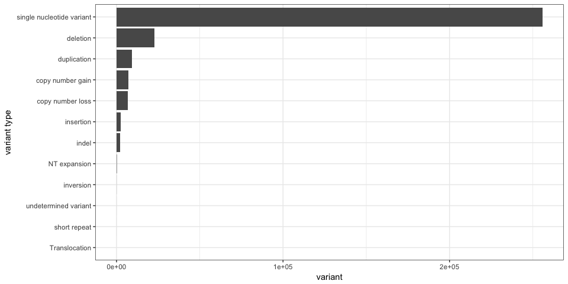

Duplicates ?
------------

Any variants annotated several times ? (Defining a variant in term of its location/coordinates)

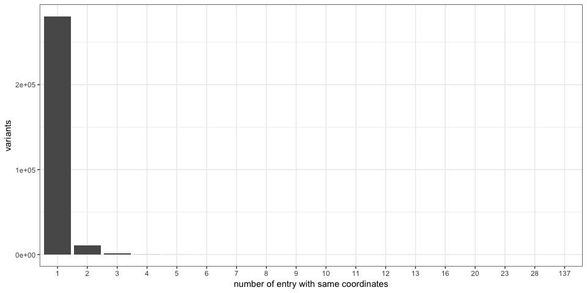

Most of them are fine but a few are annotated twice. Some are even annotated more than 10 times !?

### Annotated twice ?

Quick look at a few random variants that are annotated twice:

| Chromosome |      Start|       Stop|  X.AlleleID| Type                      | ReferenceAllele | AlternateAllele |  nbentry|
|:-----------|----------:|----------:|-----------:|:--------------------------|:----------------|:----------------|--------:|
| 1          |  237742285|  237742285|       52872| deletion                  | T               | -               |        2|
| 1          |  237742285|  237742285|      172569| duplication               | T               | TT              |        2|
| 12         |  102844368|  102844368|      108219| single nucleotide variant | C               | T               |        2|
| 12         |  102844368|  102844368|      108220| single nucleotide variant | C               | A               |        2|
| 15         |   48288430|   48288430|      380140| duplication               | C               | CC              |        2|
| 15         |   48288430|   48288430|      340677| single nucleotide variant | C               | T               |        2|
| 17         |   43074349|   43074349|       69921| single nucleotide variant | A               | T               |        2|
| 17         |   43074349|   43074349|      416439| single nucleotide variant | A               | G               |        2|
| 9          |   95469851|   95469851|      240681| single nucleotide variant | G               | C               |        2|
| 9          |   95469851|   95469851|      212733| single nucleotide variant | G               | A               |        2|

It seems it's either because the type is different or the SNV alleles are different. Of note, with their index strategy, SNV and 1 bp deletion have the same coordinate...

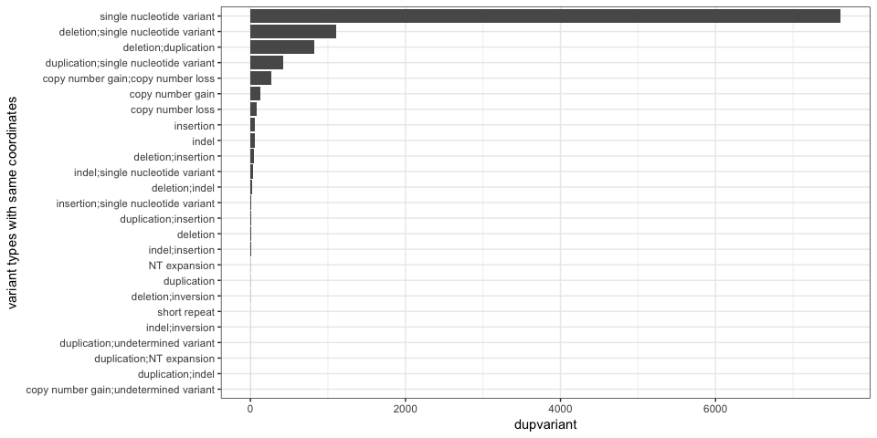

Actually it can also be a locus annotated as deletion/duplication, or deletion/indel.

### Annotated \>10 times !?

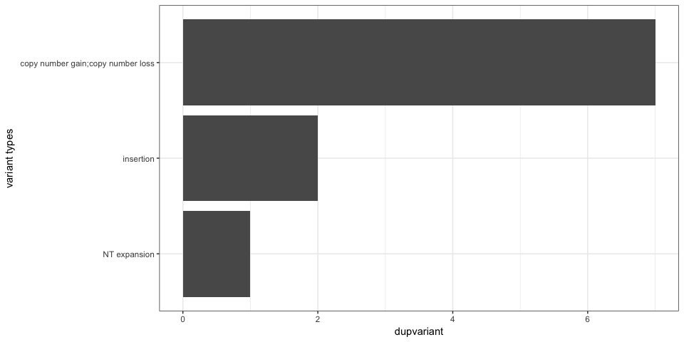

It's only CNVs, insertions and NT expansions.

### Deletions

If we focus on *deletions*, we should avoid the SNV, CNV and insertion duplicates. But do we still get duplicates ?

|  nbentry|  variant|
|--------:|--------:|
|        1|    22901|
|        2|        8|
|        3|        1|
|        4|        1|

Yes but just a couple:

| Chromosome |      Start|       Stop|  X.AlleleID| ClinicalSignificance |  RS...dbSNP.| nsv.esv..dbVar. |  nbentry|
|:-----------|----------:|----------:|-----------:|:---------------------|------------:|:----------------|--------:|
| 16         |    2065519|    2065635|       58814| not provided         |    137854159| -               |        2|
| 16         |    2065519|    2065635|      248512| Pathogenic           |           -1| -               |        2|
| 17         |   43067608|   43067695|       94610| Pathogenic           |           -1| -               |        2|
| 17         |   43067608|   43067695|      261604| Pathogenic           |           -1| -               |        2|
| 17         |   43076488|   43076614|      186541| Likely pathogenic    |           -1| -               |        2|
| 17         |   43076488|   43076614|      213239| Pathogenic           |           -1| -               |        2|
| 17         |   43115726|   43115779|      226212| Pathogenic           |           -1| -               |        2|
| 17         |   43115726|   43115779|      226810| Pathogenic           |           -1| -               |        2|
| 19         |   13206442|   13224666|       23559| Pathogenic           |           -1| nsv1197512      |        2|
| 19         |   13206442|   13224666|       23558| Pathogenic           |           -1| nsv1197512      |        2|
| 8          |   48918807|   48921265|       22543| Pathogenic           |           -1| -               |        2|
| 8          |   48918807|   48921265|       22542| Pathogenic           |           -1| -               |        2|
| X          |  108437942|  108440206|       47346| Pathogenic           |           -1| nsv1197445      |        2|
| X          |  108437942|  108440206|       47348| Pathogenic           |           -1| nsv1197446      |        2|
| X          |  108438186|  108440206|       35554| Pathogenic           |           -1| nsv1197486      |        4|
| X          |  108438186|  108440206|       35549| Pathogenic           |           -1| nsv1197493      |        4|
| X          |  108438186|  108440206|       35552| Pathogenic           |           -1| nsv1197477      |        4|
| X          |  108438186|  108440206|       35553| Pathogenic           |           -1| nsv1197485      |        4|
| X          |  108655331|  108655457|       35952| Pathogenic           |           -1| nsv1197374      |        2|
| X          |  108655331|  108655457|       35949| Pathogenic           |           -1| nsv1197373      |        2|
| X          |   49922616|   50099235|      204275| Pathogenic           |           -1| -               |        3|
| X          |   49922616|   50099235|      204273| Pathogenic           |           -1| -               |        3|
| X          |   49922616|   50099235|      204274| Pathogenic           |           -1| -               |        3|

Clinical significance
---------------------

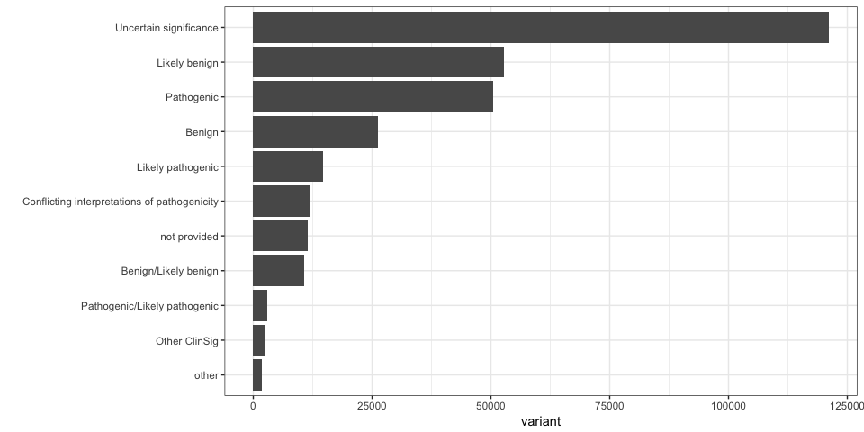

90 different types of *ClinicalSignificance* but just a few major ones. In the previous graph, all the minor *ClinicalSignificance* (not in top 10) were merged into one called *Other ClinSig*.

Same graph for deletions only:

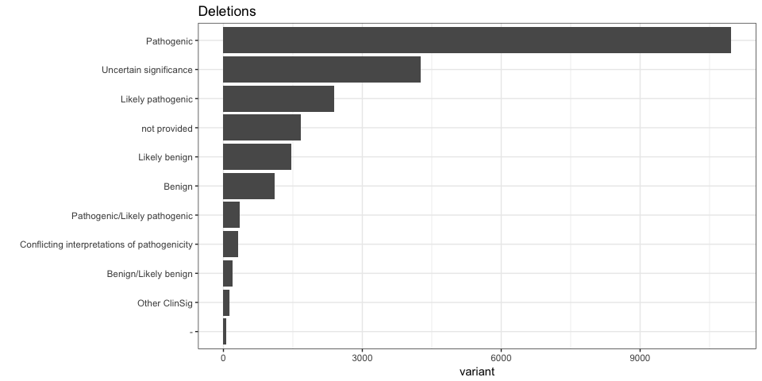

### Containing *pathogenic*

Looking for any definition that include the word *pathogenic*.

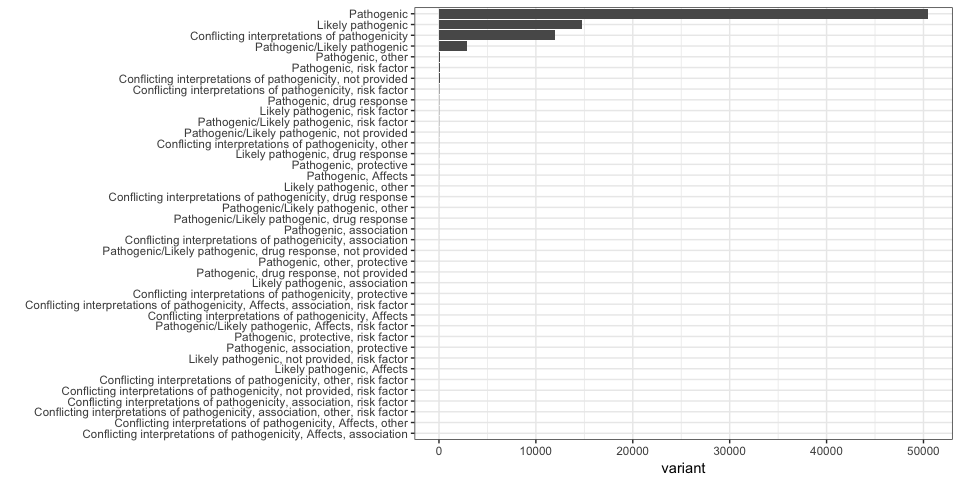

Some definitions specify *pathogenic* and something else, for example `Pathogenic, risk factor`. It just a few variants but we might want to include them with the `Pathogenic` group.

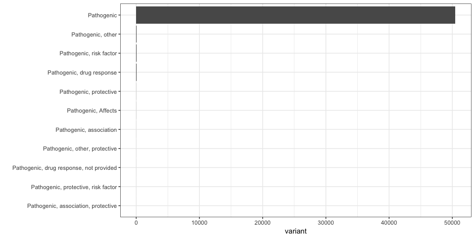

Variant size
------------

Let's remove the *single nucleotide variant* type.

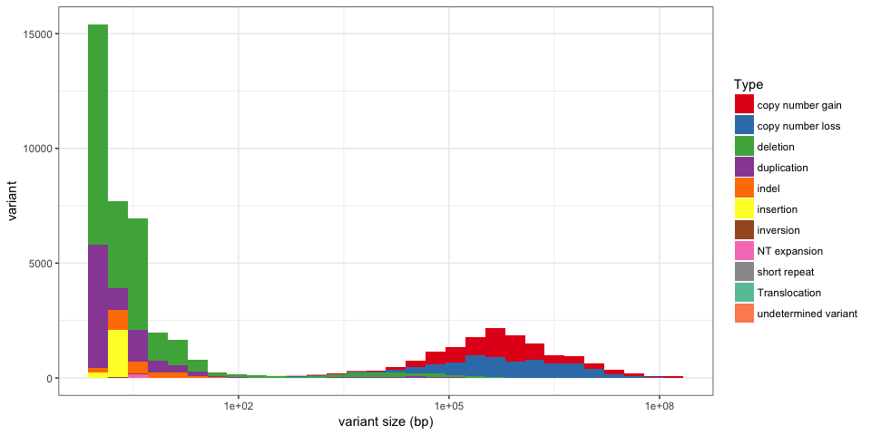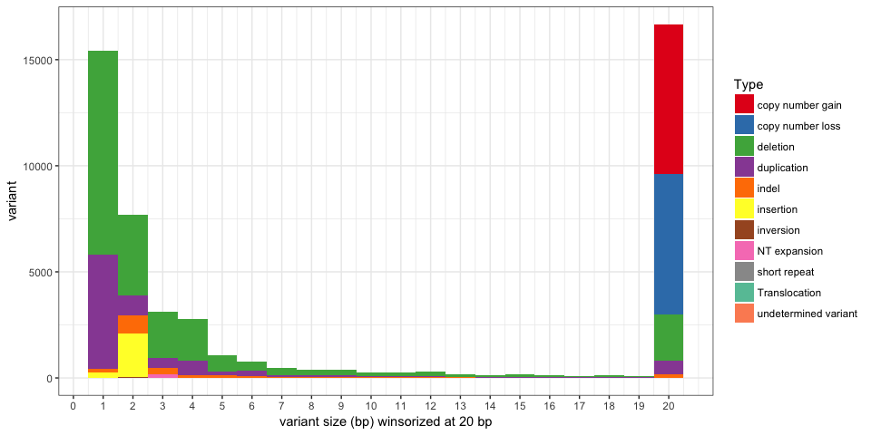

### Deletions

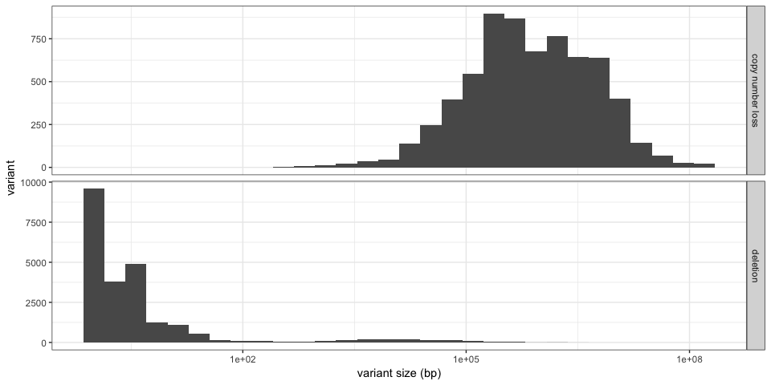

All *copy number loss* variants are large.

### 3 bp pattern

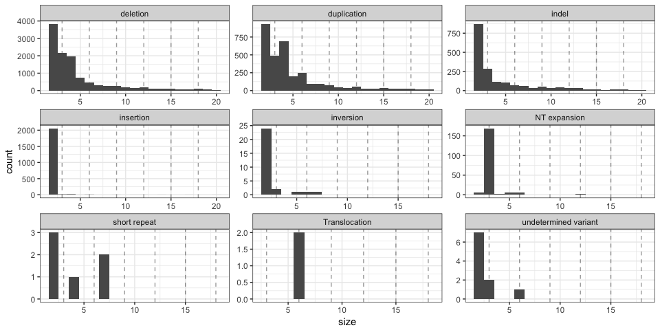

*Note: I removed variants of size 1 bp for clarity.*

Globally there is no striking "3 bp" pattern except for NT expansions that are mostly 3 bp long.

Let's look at pathogenic variants.

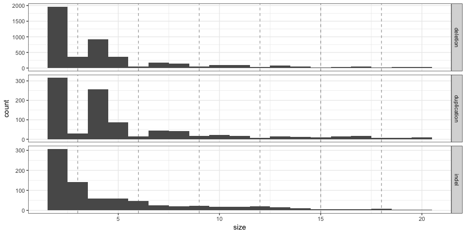

Pathogenic deletions and duplications are less likely to be multiple of 3 bp. Kind of expected because these variants doesn't cause frame-shifts and might be more tolerated.

Indels don't show this pattern but it might be because they are annotated differently. For example with a reference allele of `TATTT` and alternate allele of `TA`, they would still be annotated in a region of size 5 bp in the database although it represents a 3 bp deletion. If we subtract the length of the alleles we should get the pattern:

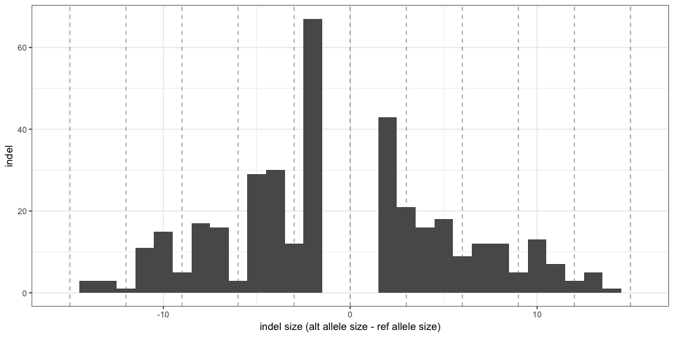

Yep.

Support
-------

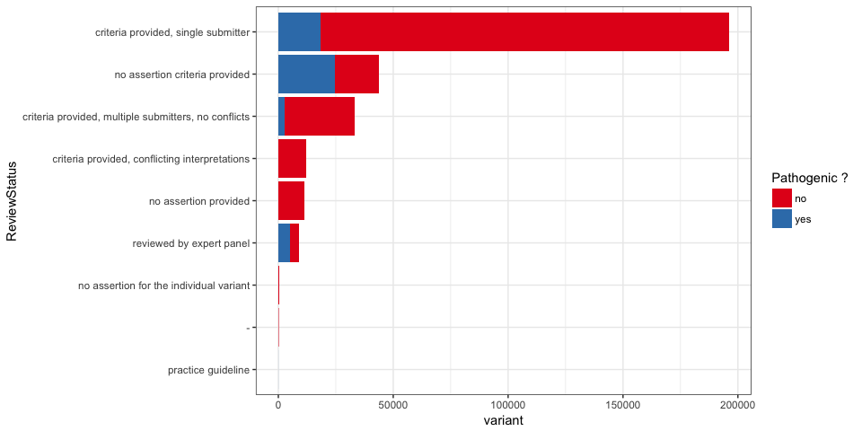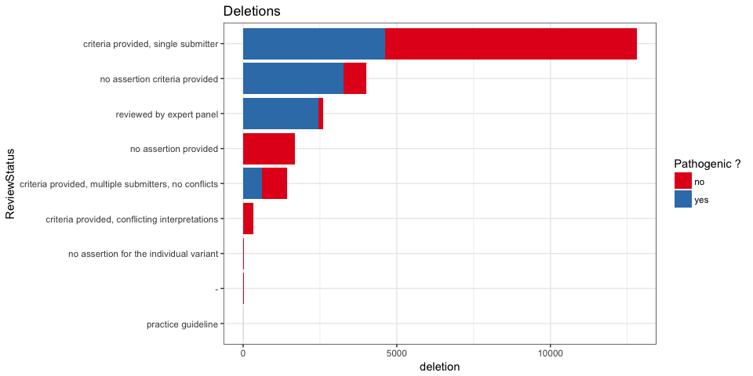

Chromosome distribution
-----------------------

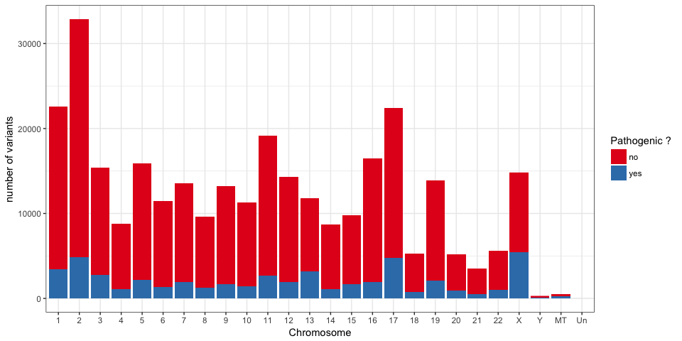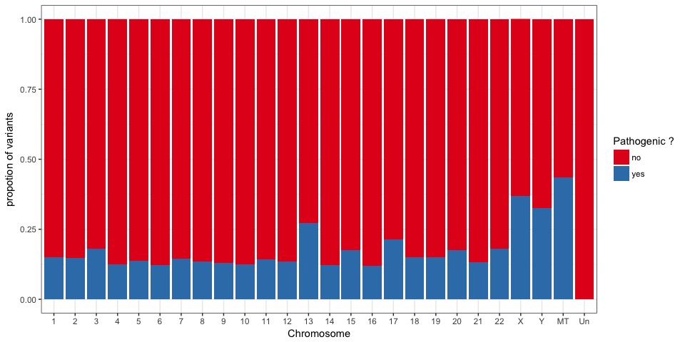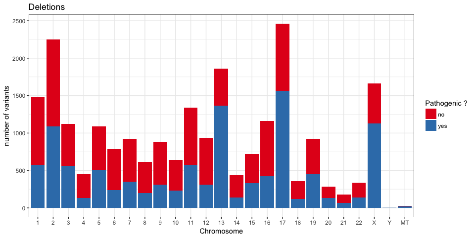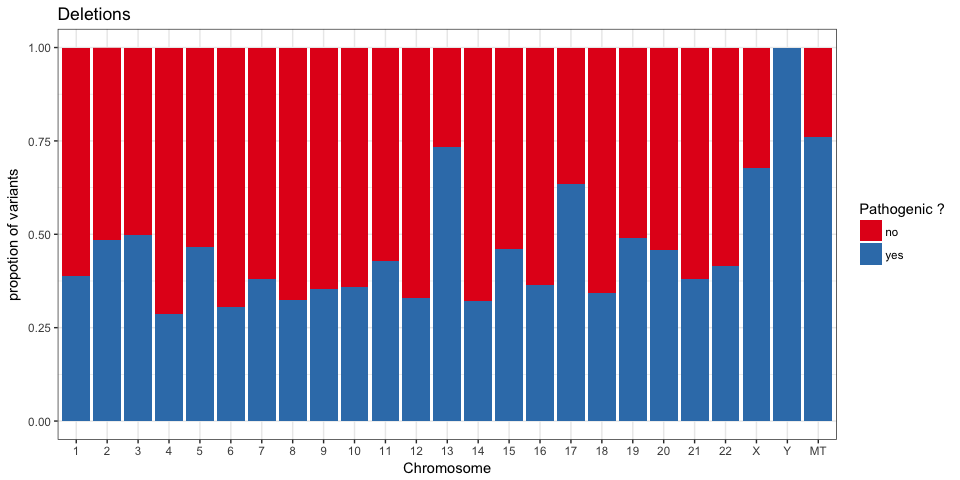

*To do: normalize each chromosome by its number of genes.*

Gene's affected
---------------

Just out of curiosity, are there certain genes that have more pathogenic variants than others ?

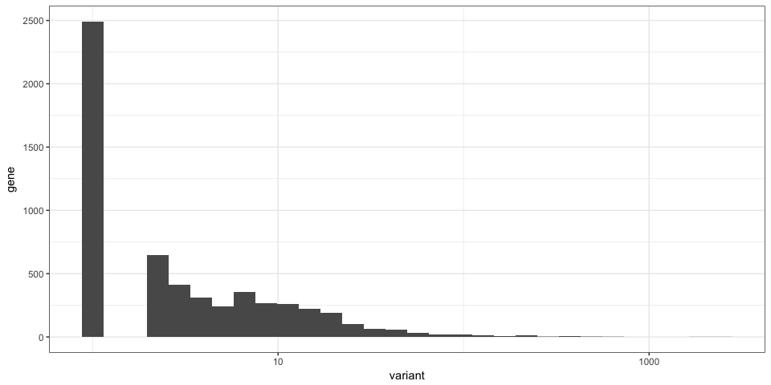

| GeneSymbol |  variant|  deletion|
|:-----------|--------:|---------:|
| BRCA2      |     2463|      1229|
| BRCA1      |     2131|      1049|
| MSH2       |      592|       270|
| LDLR       |      566|       260|
| COL4A5     |      555|       130|
| MLH1       |      544|       248|

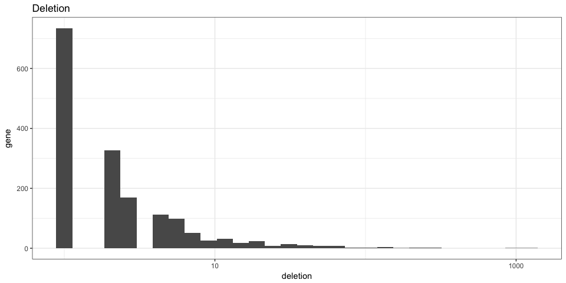

| GeneSymbol |  variant|  deletion|
|:-----------|--------:|---------:|
| BRCA2      |     2463|      1229|
| BRCA1      |     2131|      1049|
| MSH2       |      592|       270|
| LDLR       |      566|       260|
| MLH1       |      544|       248|
| MECP2      |      382|       206|

Discussion
----------

### Flexible filtering of *pathogenic* variants

If we include the few variants that are annotated as *Pathogenic* and something else, how many pathogenic *deletions* are we gaining ?

| ClinicalSignificance    |  deletion|
|:------------------------|---------:|
| Pathogenic              |     10959|
| Pathogenic, risk factor |        10|
| Pathogenic, other       |         7|
| Pathogenic, protective  |         2|
| Pathogenic, association |         1|

Just 20 variants.

### Include other types of deletions ?

If we are interested in deletions, how much are we gaining by including different variants types versus only the *deletion* type ?

We could think of including *copy number loss* or *indels*.

#### Could we use "indel" deletions ?

Short answer: No.

For indels it's a bit tricky to get the deletion coordinates. With a reference allele of `TATTT` and alternate of `TA` we can guess but what if we have something like `TGAGTAATGTAAG` and `GG` (real variant) ?

Actually maybe they are all "difficult" and would have been annotated as *deletion* if it was easy to guess the exact location. Let's check just in case. I'll look for variants where the alternate allele is exactly included in the reference allele and on a "side".

| easyDeletion |  indel|
|:-------------|------:|
| FALSE        |    702|

I found none so indels are deletions were the breakpoints.

#### Copy number loss

We would gain a lot of large deletions by including *copy number loss* variants. I'm not sure if we can trust the breakpoints location as much as small deletions though. In the [instructions to submit to ClinVar](https://www.ncbi.nlm.nih.gov/clinvar/docs/spreadsheet/), it's written that *Start* and *Stop* columns should be used when the exact breakpoint is known. It's also writtent that *copy number loss* variants are based on arrays so I don't think the breakpoints are accurate (except if the variant were further validated and breakpoints fine-tuned).
