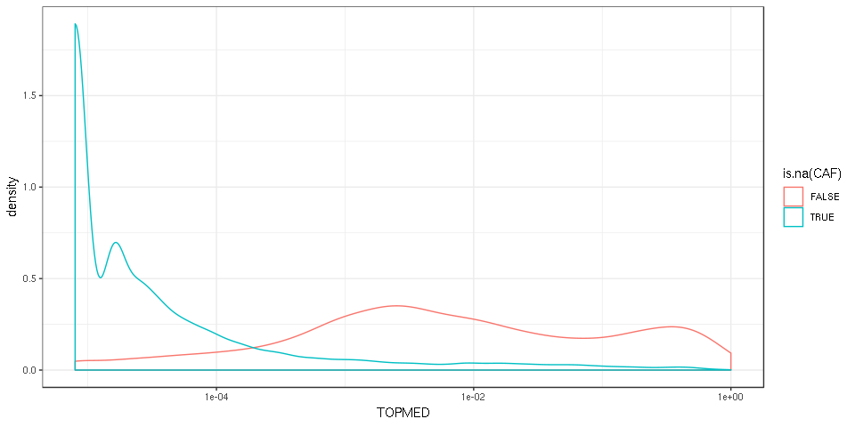
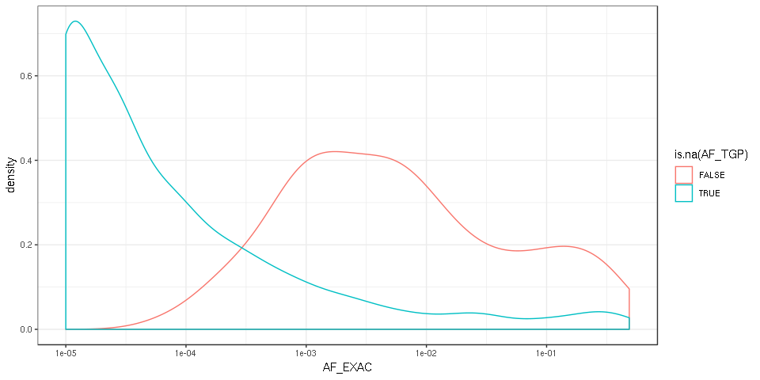
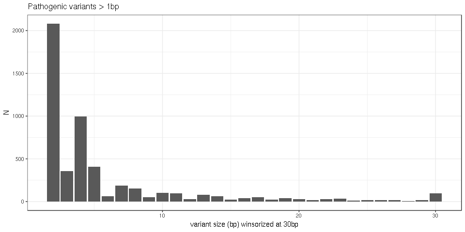

dbSNP/ClinVar exploration
=========================

`GENEINFO` columns the same?
----------------------------

There is a *GENEINFO* column that comes from the dbSNP VCF and another one from the ClinVar. Are they the same? Or should we really keep both?

|  prop.same.geneinfo|
|-------------------:|
|           0.8841564|

| GENEINFO                    | GENEINFO.ClinVar      |
|:----------------------------|:----------------------|
| B3GALT6:126792,SDF4:51150   | B3GALT6:126792        |
| B3GALT6:126792,SDF4:51150   | B3GALT6:126792        |
| B3GALT6:126792,SDF4:51150   | B3GALT6:126792        |
| B3GALT6:126792,SDF4:51150   | B3GALT6:126792        |
| MIR6808:102466740,DVL1:1855 | DVL1:1855             |
| PLCH2:9651,PEX10:5192       | PEX10:5192,PLCH2:9651 |

The columns are the same only 88% of the time. Often a gene is "missing" in the ClinVar column. Or is it because the ClinVar column only shows the disease-relevant gene?

Consistent frequencies?
-----------------------

Are the frequency from the 1000GP, ExAC and TOPMED consistent?

Quite consistent.

No frequency means rare?
------------------------

When the frequency information is missing (e.g. 1000GP frequency), is the variant rare?

We would expect so: there is no information because these variants were not seen in the study because they are rare. Let's check that the frequency in the larger studies (TOPMED, ExAC) is on the rare side.

Yep.

Citations
---------

The *citation* column is specific to ClinVar variants.

Do most variants in ClinVar have associated citations? How many non-pathogenic variants have a citation associated with them?

| CLNSIG                                          |  nb.var|  prop.wth.citation|
|:------------------------------------------------|-------:|------------------:|
| Pathogenic                                      |   10548|          0.5812476|
| Uncertain\_significance                         |    4801|          0.2711935|
| Likely\_pathogenic                              |    2430|          0.4164609|
| Likely\_benign                                  |    1921|          0.3029672|
| Benign                                          |    1320|          0.3992424|
| not\_provided                                   |    1225|          0.2318367|
| Conflicting\_interpretations\_of\_pathogenicity |     452|          0.8141593|
| Pathogenic/Likely\_pathogenic                   |     436|          0.8853211|
| Benign/Likely\_benign                           |     261|          0.7816092|
| -                                               |      50|          0.8200000|

Around 60% of pathogenic variants (the largest class of variants in ClinVar) have at least one associated publication.

Duplicates
----------

Any variants annotated several times? (Defining a variant in term of its location/coordinates)

Most of them are fine but a few are annotated twice. Some are even annotated 10 times !?

Here are a few doublets:

| chr  |  start|    end| CAF    | TOPMED              | GENEINFO                        | MC  | AF\_EXAC | AF\_TGP |  ALLELEID| CLNSIG | GENEINFO.ClinVar | MC.ClinVar | citation | geneloc    |  varL|  mhL|  mh1L|  nbentry|
|:-----|------:|------:|:-------|:--------------------|:--------------------------------|:----|:---------|:--------|---------:|:-------|:-----------------|:-----------|:---------|:-----------|-----:|----:|-----:|--------:|
| chr1 |  13958|  13958| -      | -                   | DDX11L1:100287102|WASH7P:653635 | INT | NA       | NA      |        NA| NA     | NA               | NA         | NA       | exonic     |     1|    1|     1|        2|
| chr1 |  13958|  13958| -      | 0.01379332313965341 | DDX11L1:100287102|WASH7P:653635 | INT | NA       | NA      |        NA| NA     | NA               | NA         | NA       | exonic     |     1|    1|     1|        2|
| chr1 |  54715|  54724| -      | -                   | -                               | -   | NA       | NA      |        NA| NA     | NA               | NA         | NA       | intergenic |    10|    9|     1|        2|
| chr1 |  54715|  54724| -      | 0.02604166666666666 | -                               | -   | NA       | NA      |        NA| NA     | NA               | NA         | NA       | intergenic |    10|    9|     1|        2|
| chr1 |  54721|  54725| -      | -                   | -                               | -   | NA       | NA      |        NA| NA     | NA               | NA         | NA       | intergenic |     5|    2|     2|        2|
| chr1 |  54721|  54725| -      | 0.07098146024464831 | -                               | -   | NA       | NA      |        NA| NA     | NA               | NA         | NA       | intergenic |     5|    2|     2|        2|
| chr1 |  63736|  63738| 0.3718 | -                   | -                               | -   | NA       | NA      |        NA| NA     | NA               | NA         | NA       | exonic     |     3|    3|     3|        2|
| chr1 |  63736|  63738| 0.3718 | 0.24307944699286442 | -                               | -   | NA       | NA      |        NA| NA     | NA               | NA         | NA       | exonic     |     3|    3|     3|        2|
| chr1 |  66274|  66275| -      | -                   | -                               | -   | NA       | NA      |        NA| NA     | NA               | NA         | NA       | intronic   |     2|    1|     1|        2|
| chr1 |  66274|  66275| -      | -                   | -                               | -   | NA       | NA      |        NA| NA     | NA               | NA         | NA       | intronic   |     2|    1|     1|        2|

Because the *TOPMED* column seems mostly at fault, I would guess that these variants are duplicates in the original dbSNP VCF file.

Variant size
------------

