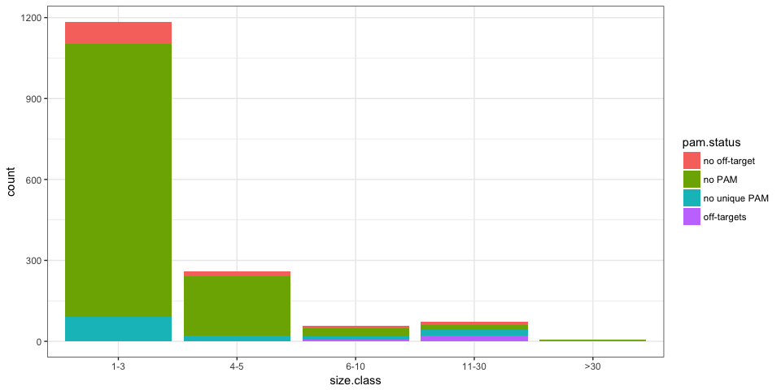
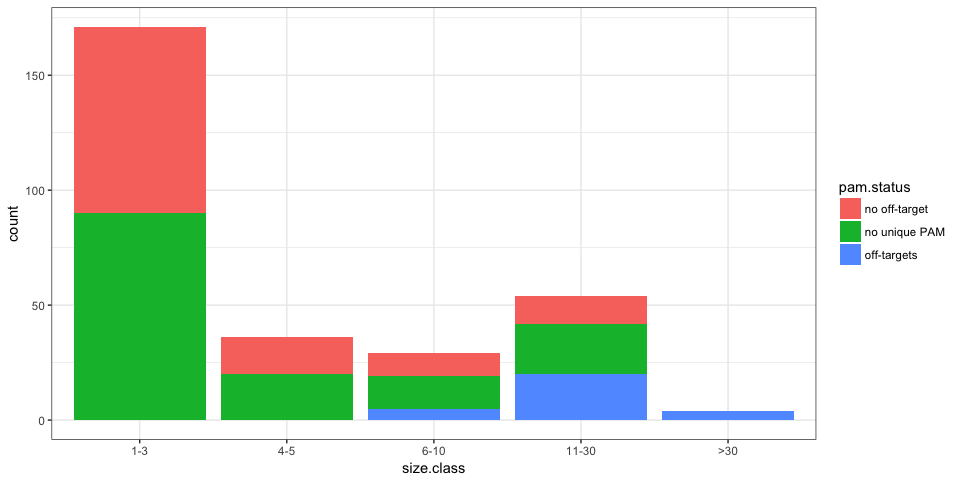

Coding deletions in dbSNP
=========================

I ran MHcut on small deletions in coding regions present in dbSNP. Note: I started by looking at the *common* indels. Although they are not necessarily pathogenic, they almost always cause frame-shifts and might have a strong functional impact.

Quick numbers
-------------

|  pam|  pam.uniq|  pam.uniq.noOt|
|----:|---------:|--------------:|
|  247|       130|            103|

PAM availability
----------------

Overlap with the ClinVar run
----------------------------

Focusing on the variants whose rsID are among the ones in our ClinVar run:

|  pam|  pam.uniq|  pam.uniq.noOt|
|----:|---------:|--------------:|
|    9|         3|              2|

Not much overlap, most likely because I'm looking at the common variants and the ones in ClinVar are rare. I'll redo the analysis with all indels in dbSNP, not matter the frequency.
