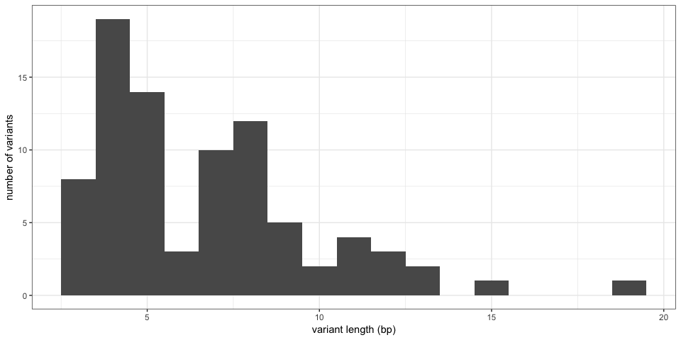
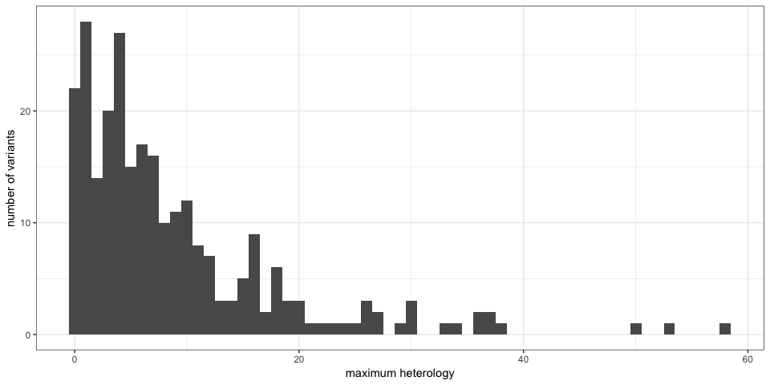
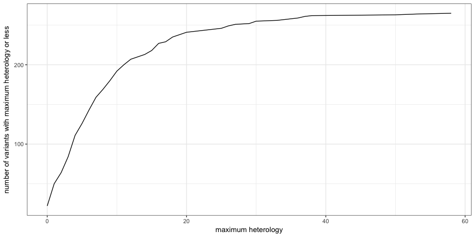
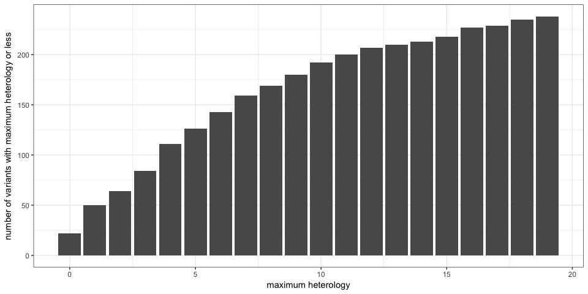
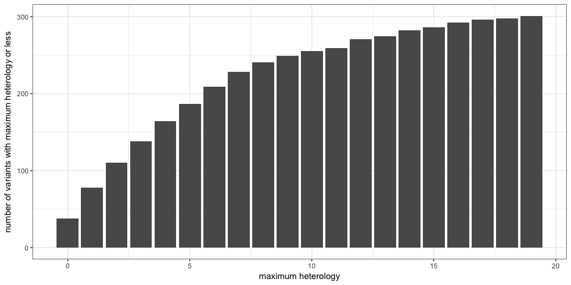
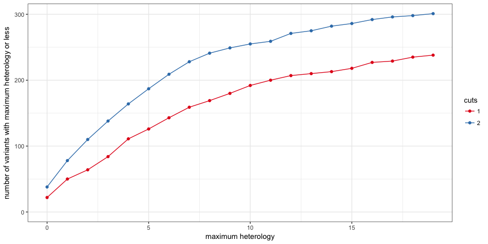
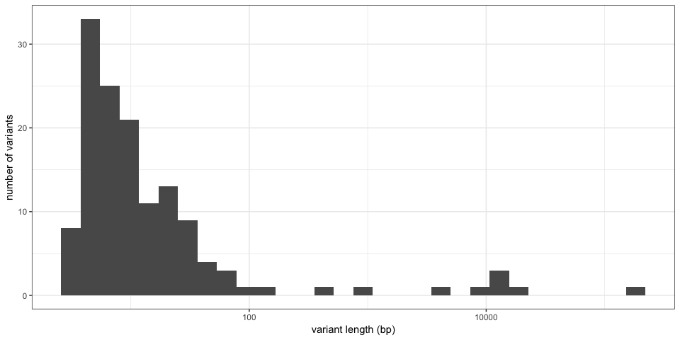

HowTo: Filter the "guide" output
================================

First, load some packages and import MHcut results.

``` r
## For data manipulation
library(dplyr)

## For graphs and tables
library(ggplot2)
library(knitr)

## Import 'guide' output
guides = read.table("../clinvar-grch38-pathogenic-deletion-guides.tsv", header = TRUE, 
    sep = "\t", as.is = TRUE)
```

Finding the best PAM cut for small variants
-------------------------------------------

Let's keep only variants smaller than 100 bp.

``` r
guides.small = filter(guides, varL < 100)
```

### Keep only PAMs with maximum heterology of X

For example, to keep only guides with maximum 3 bp heterologies:

``` r
guides.small.maxhet3 = filter(guides.small, mhDist1 <= 3, mhDist2 <= 3)
head(guides.small.maxhet) %>% kable
```

| Chromosome |      Start|       Stop| GeneSymbol |      dbSNP| dbVar | reviewStatus                        |  nbSubmitters|  varL|  mhL|  mh1L|   hom|  nbMM|  mhDist| MHseq1    | MHseq2    |  pamMot|  bestPamHet| protospacer          |  mm0|  mm1|  mm2|  m1Dist1|  m1Dist2|  mhDist1|  mhDist2|
|:-----------|----------:|----------:|:-----------|----------:|:------|:------------------------------------|-------------:|-----:|----:|-----:|-----:|-----:|-------:|:----------|:----------|-------:|-----------:|:---------------------|----:|----:|----:|--------:|--------:|--------:|--------:|
| chr1       |  110064600|  110064603| ALX3       |  387906319| -     | no assertion criteria provided      |             1|     4|    4|     4|  1.00|     0|       0| TCAG      | TCAG      |       1|           0| CAGTCAGGTCTGTGCGCAGG |    1|    0|    0|        0|        0|        0|        0|
| chr1       |  154988133|  154988136| FLAD1      |  876661313| -     | criteria provided, single submitter |             2|     4|    4|     4|  1.00|     0|       0| TCTT      | TCTT      |       1|           0| TCTTTCTGTGCCGGACACTG |    1|    0|    0|        0|        0|        0|        0|
| chr1       |  156134513|  156134515| LMNA       |  267607540| -     | no assertion criteria provided      |             2|     3|    3|     3|  1.00|     0|       0| AAG       | AAG       |       1|           0| GAAGAACATCTACAGTGAGG |    1|    1|    0|        0|        0|        0|        0|
| chr1       |  228351314|  228351324| OBSCN      |  869312933| -     | criteria provided, single submitter |             1|    11|    9|     5|  0.89|     1|       2| GGTGGACCT | GGTGGGCCT |       2|           2| GTGCCCTCCGGGTGGATTCC |    1|    0|    0|        2|        4|        2|        0|
| chr1       |   40822316|   40822323| KCNQ4      |  797044972| -     | no assertion criteria provided      |             1|     8|    6|     3|  0.83|     1|       2| CGGTCC    | CGGACC    |       2|           1| GGCTGCCTGGCGCCTGTACT |    1|    0|    0|        0|        5|        0|        2|
| chr1       |   40822316|   40822323| KCNQ4      |  797044972| -     | no assertion criteria provided      |             1|     8|    6|     3|  0.83|     1|       2| CGGTCC    | CGGACC    |       2|           1| CCCCATACCACCAGGCTGCC |    1|    0|    0|        1|        4|        1|        1|

This subset could be exported back to a `.tsv` file:

``` r
write.table(guides.small.maxhet3, file = "guides-maxHet3.tsv", quote = FALSE, 
    sep = "\t", row.names = FALSE)
```

What is the size distribution of these variants ? *If a variant has several guides, it is counted only once.*

``` r
guides.small.maxhet3 %>% select(Chromosome, Start, Stop, varL) %>% unique %>% 
    ggplot(aes(varL)) + geom_histogram(binwidth = 1) + theme_bw() + ylab("number of variants") + 
    xlab("variant length (bp)")
```



### Playing with the heterology threshold

The same variant can have several valid PAM cuts and guides. We might want to count the variants instead of the guides. **For each variant, we use the best guide** (the one with the lowest heterology).

``` r
guides.small.best = guides.small %>% mutate(maxHet = ifelse(mhDist1 > mhDist2, 
    mhDist1, mhDist2)) %>% group_by(Chromosome, Start, Stop) %>% summarize(maxHet = min(maxHet))
ggplot(guides.small.best, aes(x = maxHet)) + geom_histogram(binwidth = 1) + 
    theme_bw() + xlab("maximum heterology") + ylab("number of variants")
```



``` r
## Cumulative distribution: how many with Xbp heterology or less.
guides.small.best %>% group_by(maxHet) %>% summarize(nb = n()) %>% ungroup %>% 
    mutate(cumnb = cumsum(nb)) %>% ggplot(aes(x = maxHet, y = cumnb)) + geom_line() + 
    theme_bw() + xlab("maximum heterology") + ylab("number of variants with maximum heterology or less")
```



``` r
## Zooming in [0,20] range
guides.small.best %>% filter(maxHet < 20) %>% group_by(maxHet) %>% summarize(nb = n()) %>% 
    ungroup %>% mutate(cumnb = cumsum(nb)) %>% ggplot(aes(x = maxHet, y = cumnb)) + 
    geom_bar(stat = "identity") + theme_bw() + xlab("maximum heterology") + 
    ylab("number of variants with maximum heterology or less")
```



Finding the 2 best PAM cuts for large variants
----------------------------------------------

If we consider using two cuts, what would be the maximum heterology ?

For each variant, I record the best heterology on the left side and on the right side, among all the valid guides for this variant.

``` r
guides.2cuts = guides %>% group_by(Chromosome, Start, Stop, varL) %>% summarize(mhDist1 = min(mhDist1), 
    mhDist2 = min(mhDist2)) %>% mutate(maxHet = ifelse(mhDist1 > mhDist2, mhDist1, 
    mhDist2))

guides.2cuts %>% filter(maxHet < 20) %>% group_by(maxHet) %>% summarize(nb = n()) %>% 
    ungroup %>% mutate(cumnb = cumsum(nb)) %>% ggplot(aes(x = maxHet, y = cumnb)) + 
    geom_bar(stat = "identity") + theme_bw() + xlab("maximum heterology") + 
    ylab("number of variants with maximum heterology or less")
```



Comparing one-cut versus two-cuts approaches:

``` r
guides.comp12 = rbind(guides.small.best %>% filter(maxHet < 20) %>% mutate(cut = 1), 
    guides.2cuts %>% filter(maxHet < 20) %>% mutate(cut = 2))

guides.comp12.s = guides.comp12 %>% group_by(cut, maxHet) %>% summarize(nb = n()) %>% 
    group_by(cut) %>% mutate(cumnb = cumsum(nb))
ggplot(guides.comp12.s, aes(x = maxHet, y = cumnb, colour = factor(cut))) + 
    geom_line() + geom_point() + theme_bw() + xlab("maximum heterology") + ylab("number of variants with maximum heterology or less") + 
    scale_colour_brewer(name = "cuts", palette = "Set1") + ylim(0, max(guides.comp12.s$cumnb))
```



Out of curiosity, what is the size distribution of variants with maximum 3 bp heterology ?

``` r
guides.2cuts %>% filter(mhDist1 <= 3, mhDist2 <= 3) %>% ggplot(aes(varL)) + 
    geom_histogram() + theme_bw() + ylab("number of variants") + xlab("variant length (bp)") + 
    scale_x_log10()
```



Some large variants are now present.

Finding variants to compare 1 cut vs 2 cuts efficiency
------------------------------------------------------

To test the efficiency of having some heterology versus having to use two cuts, we would like to find variants both type of situations present.

``` r
guides.1vs2 = guides.2cuts %>% mutate(maxHet.2cuts = ifelse(mhDist1 > mhDist2, 
    mhDist1, mhDist2)) %>% select(Chromosome, Start, Stop, maxHet.2cuts)
guides.1vs2 = guides %>% mutate(maxHet = ifelse(mhDist1 > mhDist2, mhDist1, 
    mhDist2)) %>% group_by(Chromosome, Start, Stop, varL, mhDist) %>% summarize(maxHet.1cut = min(maxHet)) %>% 
    merge(guides.1vs2)
head(guides.1vs2) %>% kable
```

| Chromosome |      Start|       Stop|  varL|  mhDist|  maxHet.1cut|  maxHet.2cuts|
|:-----------|----------:|----------:|-----:|-------:|------------:|-------------:|
| chr1       |  110064600|  110064603|     4|       0|            0|             0|
| chr1       |  115740794|  115740809|    16|      13|            7|             7|
| chr1       |    1232601|    1232622|    22|      16|           10|             5|
| chr1       |    1338099|    1338111|    13|       1|            4|             4|
| chr1       |  149923568|  149923587|    20|      16|            9|             0|
| chr1       |  150553758|  150553777|    20|      10|            6|             6|

Now, we could pick variants with 0-1 bp two-cuts heterology and \>5bp one-cut heterology. We could even ask for the one-cut to be around half the distance between MH, to have a balanced cut.

``` r
guides.1vs2 %>% filter(maxHet.2cuts < 2, maxHet.1cut > 5, abs(maxHet.1cut - 
    mhDist/2) < 3) %>% arrange(varL) %>% kable
```

| Chromosome |      Start|       Stop|  varL|  mhDist|  maxHet.1cut|  maxHet.2cuts|
|:-----------|----------:|----------:|-----:|-------:|------------:|-------------:|
| chr19      |   49861766|   49861775|    10|       7|            6|             1|
| chr16      |    4802507|    4802518|    12|       9|            7|             1|
| chr1       |  149923568|  149923587|    20|      16|            9|             0|
| chr11      |   22625559|   22625581|    23|      18|           10|             0|
| chrX       |  153725764|  153725786|    23|      18|           11|             1|
| chr2       |  240870640|  240870664|    25|      20|           11|             0|
| chr11      |   72225078|   72225105|    28|      21|           13|             1|
| chr3       |  128483320|  128483347|    28|      18|           10|             0|
| chr20      |   63408414|   63408444|    31|      27|           15|             0|
| chrX       |   70027993|   70028027|    35|      25|           15|             1|
| chr17      |    7676090|    7676142|    53|      37|           19|             0|

We get a couple of variants where this could tested. For example, the cartoon for one looks like this

    chr20   63408414    63408444    KCNQ2   1057516125  -   no assertion criteria provided  1   31  4   4   1.0 0   27  TGCT    TGCT    9   15
                                    ||||                            ||||
    CCCGCACCCCTCCCGCCCAGCCTCTCGCACC-TGCTTCTCCACCTTCCCGAGCCGTCCCATCA-TGCTGGGGTCCTCGGGCAGCTCCGCCTCGGC
    _______________________________ ___/________/__/_____________// \______________________________
