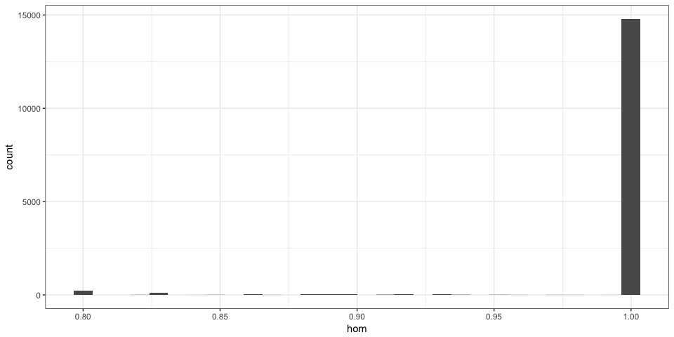
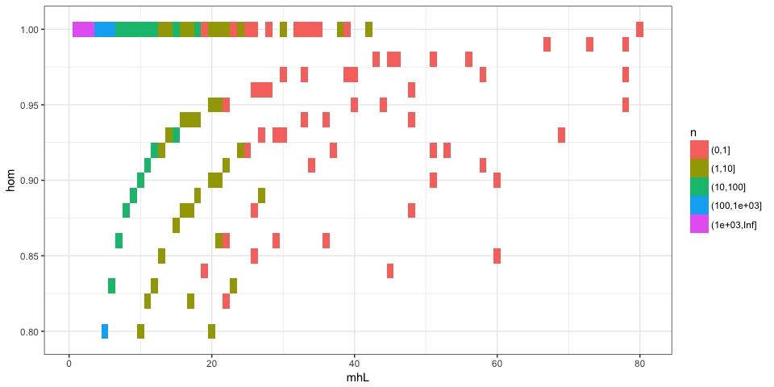
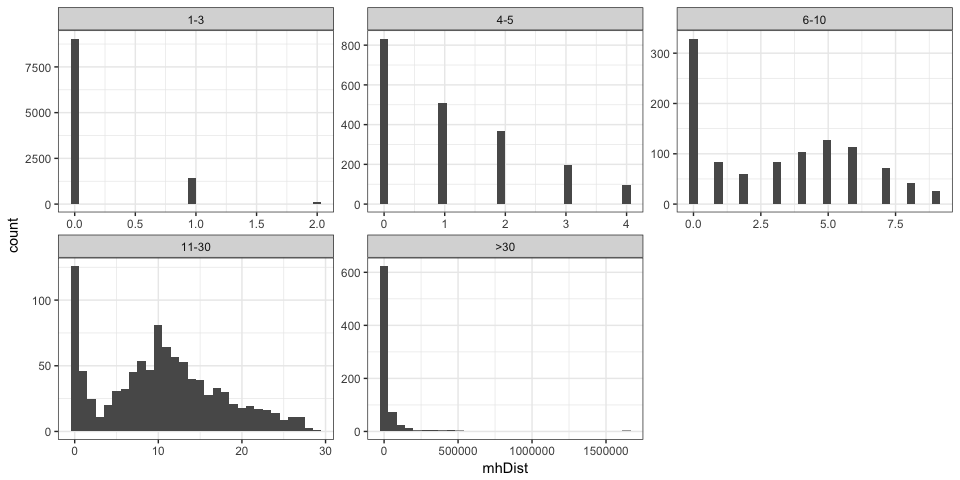
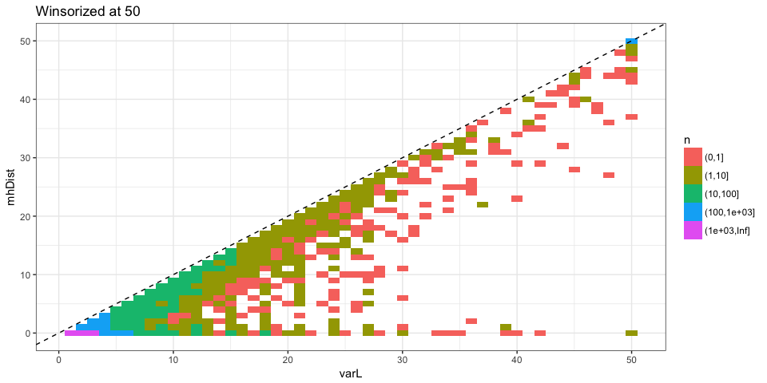
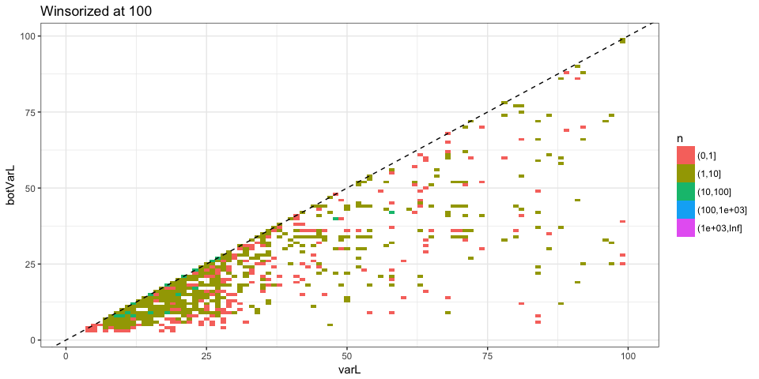
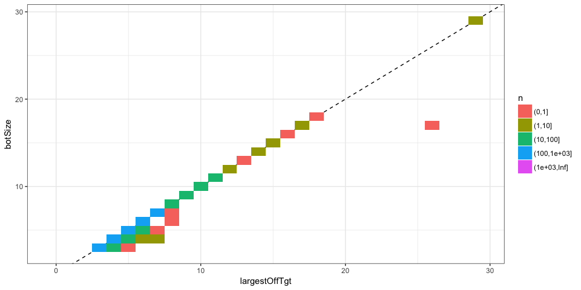

Summary of MHcut output
=======================

This report shows some simple analysis to quickly check the output of MHcut. The goal is to get an idea of the distribution of each metric in the output and check if something is off.

At the variant level
--------------------

### Extremes

Longest MH:

| Chromosome |     Start|      Stop|  mhL|  mh1L|
|:-----------|---------:|---------:|----:|-----:|
| chr16      |    173301|    177104|  882|   430|
| chr19      |  11087726|  11100911|   78|    42|
| chr19      |  40396792|  40396869|   78|    66|
| chr21      |  46334571|  46334648|   78|    35|
| chr3       |  37008382|  37010790|   73|    33|
| chr2       |  47410911|  47426291|   69|    34|

Most distant MHs:

| Chromosome |      Start|       Stop|  mhL|  mh1L|     varL|   mhDist|
|:-----------|----------:|----------:|----:|-----:|--------:|--------:|
| chrX       |    6528271|    8167329|    1|     1|  1639059|  1639058|
| chrX       |    6538718|    8151196|    1|     1|  1612479|  1612478|
| chr7       |   69899499|   70435751|    3|     3|   536253|   536250|
| chr16      |   21939023|   22424261|    1|     1|   485239|   485238|
| chr6       |   55911787|   56388992|    1|     1|   477206|   477205|
| chr6       |  161785772|  162262765|    1|     1|   476994|   476993|

### Variant length vs MH length

### Homology

### Distance between MHs

### PAM status

Defining the PAM status based on `pamMot`, `pamUniq` and `guidesNoOT` columns.

*The `NA`s represents variants that were not tested for off-target because too large.*

At the guide level
------------------

### Best off-target MH

For now the *best off-target* MH is based on the MMEJ score.

Best off-target is the longest off-target ?

Conclusions
-----------

The output looks fine to me.
