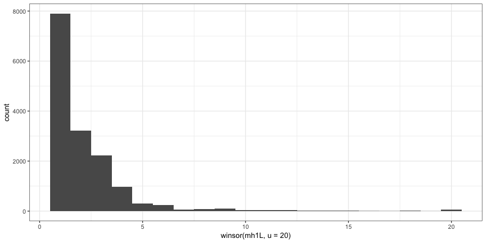

Summary of MHcut output
=======================

This report shows some simple analysis to quickly check the output of MHcut. The goal is to get an idea of the distribution of each metric in the output and check if something is off.

At the variant level
--------------------

### PAM status

| Chromosome |      Start|       Stop|  pamMot|  guidesNoOT| guideMinOT |
|:-----------|----------:|----------:|-------:|-----------:|:-----------|
| chr1       |  102913660|  102913671|       2|           0| -          |
| chr1       |    1049937|    1049951|       1|           0| 2          |
| chr1       |  111982045|  111982047|       1|           0| -          |
| chr1       |  114688745|  114688748|       1|           0| -          |
| chr1       |  115695149|  115695152|       1|           0| -          |
| chr1       |  116387403|  116387417|       1|           0| 1          |

**Something wrong** with the `guideMinOT`: when `pamMot>0` and `guidesNoOT==0` some variants have `-` in their `guideMinOT` column. I think it's because there are valid PAMs but no unique ones, so they are not tested for off-targets. I should really clarify the output and use `NA` as default values in columns to avoid confusion.

At the guide level
------------------
