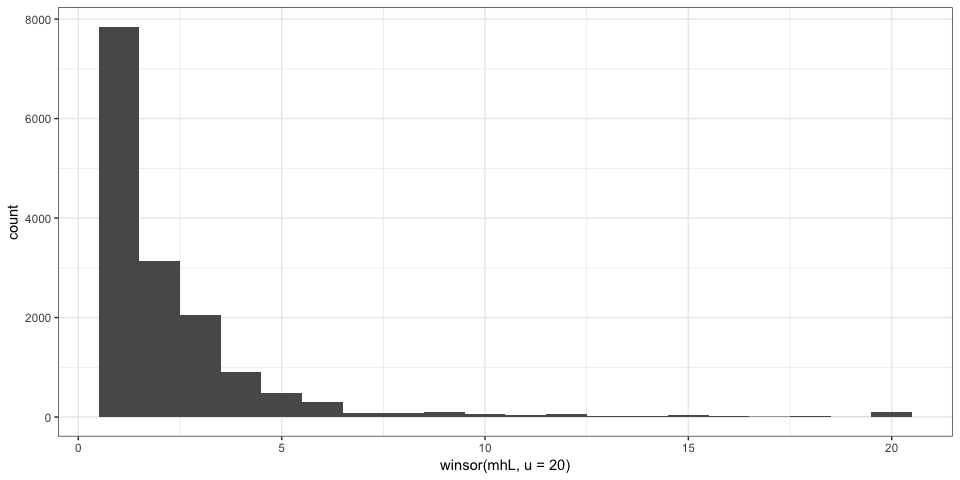
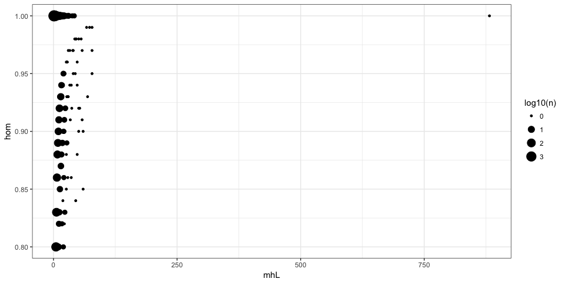

Summary of MHcut output
=======================

This report shows some simple analysis to quickly check the output of MHcut. The goal is to get an idea of the distribution of each metric in the output and check if something is off.

At the variant level
--------------------

### PAM status

*The `NA`s represents variants that were not tested for off-target because too large.*

At the guide level
------------------

After a quick look, it seems fine.
